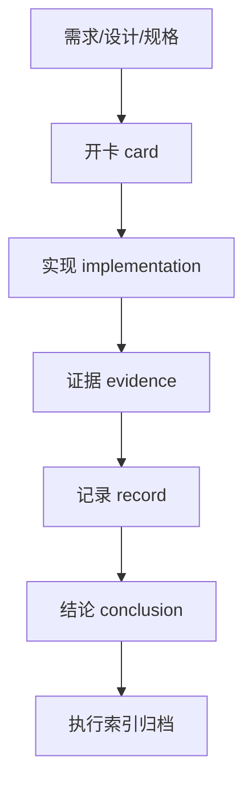

# 执行卡纪律

日期：`2026-04-09`
状态：`生效`

## 正式入口

每一个正式实现任务都必须先开执行卡。

执行卡必须写清楚：

1. 需求来源
2. 设计来源
3. 任务分解
4. 实现边界

## 正式收口

每一个正式实现任务都必须以以下内容收口：

1. 证据
2. 记录
3. 结论

## 不允许的情况

以下情况不允许作为正式工作进入主线：

1. 没有需求的代码先行变更
2. 没有设计说明的 Schema 变更
3. 没有任务分解的大型重写
4. 没有证据或结论就宣称任务完成

## 执行闭环流程图

