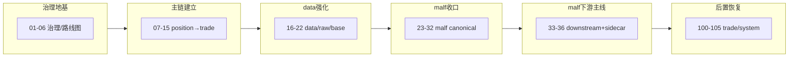

# 结论目录

日期：`2026-04-09`
状态：`持续更新`

当前最新生效结论锚点：`32-downstream-truthfulness-revalidation-after-malf-canonicalization-conclusion-20260411.md`

## 正式结论目录

1. `01-governance-tooling-and-environment-bootstrap-conclusion-20260409.md`
2. `02-shared-ledger-contract-and-pytest-path-fix-conclusion-20260409.md`
3. `03-doc-first-gating-checker-conclusion-20260409.md`
4. `04-module-lessons-and-execution-index-rename-conclusion-20260409.md`
5. `05-system-roadmap-and-progress-tracker-conclusion-20260409.md`
6. `06-roadmap-legacy-module-absorption-conclusion-20260409.md`
7. `07-position-funding-management-and-exit-contract-conclusion-20260409.md`
8. `08-position-ledger-table-family-bootstrap-conclusion-20260409.md`
9. `09-position-formal-signal-runner-and-bounded-validation-conclusion-20260409.md`
10. `10-alpha-formal-signal-contract-and-producer-conclusion-20260409.md`
11. `11-structure-filter-formal-contract-and-minimal-snapshot-conclusion-20260409.md`
12. `12-alpha-trigger-ledger-and-five-table-family-minimal-materialization-conclusion-20260409.md`
13. `13-alpha-five-table-family-shared-contract-and-family-ledger-bootstrap-conclusion-20260409.md`
14. `14-portfolio-plan-minimal-ledger-and-position-bridge-conclusion-20260409.md`
15. `15-trade-minimal-runtime-ledger-and-portfolio-plan-bridge-conclusion-20260410.md`
16. `16-data-malf-minimal-official-mainline-bridge-conclusion-20260410.md`
17. `17-raw-base-strong-checkpoint-and-dirty-materialization-conclusion-20260410.md`
18. `18-daily-raw-base-fq-incremental-update-source-selection-conclusion-20260410.md`
19. `19-tdxquant-daily-raw-source-ledger-bridge-conclusion-20260410.md`
20. `20-index-block-raw-base-incremental-bridge-conclusion-20260410.md`
21. `21-system-ledger-incremental-governance-hardening-conclusion-20260410.md`
22. `22-data-daily-source-governance-sealing-conclusion-20260411.md`
23. `23-malf-pure-semantic-ledger-boundary-freeze-conclusion-20260411.md`
24. `24-malf-mechanism-layer-break-confirmation-and-stats-sidecar-conclusion-20260411.md`
25. `25-malf-mechanism-ledger-bootstrap-and-downstream-sidecar-integration-conclusion-20260411.md`
26. `26-mainline-truthfulness-revalidation-after-malf-sidecar-bootstrap-conclusion-20260411.md`
27. `27-system-mainline-bounded-acceptance-readout-and-audit-bootstrap-conclusion-20260411.md`
28. `28-system-wide-checkpoint-and-dirty-queue-alignment-conclusion-20260411.md`
29. `29-malf-semantic-canonical-contract-freeze-conclusion-20260411.md`
30. `30-malf-canonical-ledger-and-data-grade-runner-bootstrap-conclusion-20260411.md`
31. `31-structure-filter-alpha-rebind-to-canonical-malf-conclusion-20260411.md`
32. `32-downstream-truthfulness-revalidation-after-malf-canonicalization-conclusion-20260411.md`
100. `100-trade-signal-anchor-contract-freeze-conclusion-20260411.md`
101. `101-position-entry-t-plus-1-open-reference-price-correction-conclusion-20260411.md`
102. `102-trade-exit-pnl-ledger-bootstrap-conclusion-20260411.md`
103. `103-trade-backtest-progression-runner-conclusion-20260411.md`
104. `104-mainline-real-data-smoke-regression-conclusion-20260411.md`
105. `105-system-runtime-orchestration-bootstrap-conclusion-20260411.md`

## 当前说明

1. `32` 已成为当前最新生效结论锚点。
2. `28` 仍是当前未收口的总治理主卡，当前待施工卡已推进到 `33`。
3. `29-32` 已完成并生效，当前 malf 后续主线卡组为 `33-35`，sidecar 卡为 `36`。
4. `100-105` 为 `33-36` 全部收口后的 trade/system 后置恢复卡组，**不得在 33-36 完成前提前推进**。

## 卡组进度图

