# 结论目录

`日期：2026-04-09`
`状态：生效`

当前最新生效结论锚点：`67-historical-file-length-debt-burndown-conclusion-20260415.md`

## 正式结论目录

1. `01-governance-tooling-and-environment-bootstrap-conclusion-20260409.md`
2. `02-shared-ledger-contract-and-pytest-path-fix-conclusion-20260409.md`
3. `03-doc-first-gating-checker-conclusion-20260409.md`
4. `04-module-lessons-and-execution-index-rename-conclusion-20260409.md`
5. `05-system-roadmap-and-progress-tracker-conclusion-20260409.md`
6. `06-roadmap-legacy-module-absorption-conclusion-20260409.md`
7. `07-position-funding-management-and-exit-contract-conclusion-20260409.md`
8. `08-position-ledger-table-family-bootstrap-conclusion-20260409.md`
9. `09-position-formal-signal-runner-and-bounded-validation-conclusion-20260409.md`
10. `10-alpha-formal-signal-contract-and-producer-conclusion-20260409.md`
11. `11-structure-filter-formal-contract-and-minimal-snapshot-conclusion-20260409.md`
12. `12-alpha-trigger-ledger-and-five-table-family-minimal-materialization-conclusion-20260409.md`
13. `13-alpha-five-table-family-shared-contract-and-family-ledger-bootstrap-conclusion-20260409.md`
14. `14-portfolio-plan-minimal-ledger-and-position-bridge-conclusion-20260409.md`
15. `15-trade-minimal-runtime-ledger-and-portfolio-plan-bridge-conclusion-20260410.md`
16. `16-data-malf-minimal-official-mainline-bridge-conclusion-20260410.md`
17. `17-raw-base-strong-checkpoint-and-dirty-materialization-conclusion-20260410.md`
18. `18-daily-raw-base-fq-incremental-update-source-selection-conclusion-20260410.md`
19. `19-tdxquant-daily-raw-source-ledger-bridge-conclusion-20260410.md`
20. `20-index-block-raw-base-incremental-bridge-conclusion-20260410.md`
21. `21-system-ledger-incremental-governance-hardening-conclusion-20260410.md`
22. `22-data-daily-source-governance-sealing-conclusion-20260411.md`
23. `23-malf-pure-semantic-ledger-boundary-freeze-conclusion-20260411.md`
24. `24-malf-mechanism-layer-break-confirmation-and-stats-sidecar-conclusion-20260411.md`
25. `25-malf-mechanism-ledger-bootstrap-and-downstream-sidecar-integration-conclusion-20260411.md`
26. `26-mainline-truthfulness-revalidation-after-malf-sidecar-bootstrap-conclusion-20260411.md`
27. `27-system-mainline-bounded-acceptance-readout-and-audit-bootstrap-conclusion-20260411.md`
28. `28-system-wide-checkpoint-and-dirty-queue-alignment-conclusion-20260411.md`
29. `29-malf-semantic-canonical-contract-freeze-conclusion-20260411.md`
30. `30-malf-canonical-ledger-and-data-grade-runner-bootstrap-conclusion-20260411.md`
31. `31-structure-filter-alpha-rebind-to-canonical-malf-conclusion-20260411.md`
32. `32-downstream-truthfulness-revalidation-after-malf-canonicalization-conclusion-20260411.md`
33. `33-malf-downstream-canonical-contract-purge-conclusion-20260412.md`
34. `34-malf-multi-timeframe-downstream-consumption-conclusion-20260412.md`
35. `35-downstream-data-grade-checkpoint-alignment-after-malf-conclusion-20260412.md`
36. `36-malf-wave-life-probability-sidecar-bootstrap-conclusion-20260412.md`
37. `37-system-governance-historical-debt-backlog-burndown-conclusion-20260412.md`
38. `38-structure-filter-mainline-legacy-malf-semantic-purge-conclusion-20260413.md`
39. `39-mainline-local-ledger-standardization-bootstrap-conclusion-20260413.md`
40. `40-mainline-local-ledger-incremental-sync-and-resume-conclusion-20260413.md`
41. `41-alpha-pas-five-trigger-canonical-detector-conclusion-20260413.md`
42. `42-alpha-family-role-and-malf-alignment-conclusion-20260413.md`
43. `43-structure-filter-alpha-data-grade-quality-gate-before-position-conclusion-20260413.md`
44. `44-structure-filter-official-ledger-replay-smoke-hardening-conclusion-20260413.md`
45. `45-alpha-formal-signal-producer-hardening-before-position-conclusion-20260413.md`
46. `46-pre-position-upstream-acceptance-gate-conclusion-20260413.md`
47. `47-position-malf-context-driven-sizing-and-batch-contract-conclusion-20260414.md`
48. `48-position-risk-budget-and-capacity-ledger-hardening-conclusion-20260414.md`
49. `49-position-batched-entry-trim-and-partial-exit-contract-conclusion-20260414.md`
50. `50-position-data-grade-checkpoint-and-replay-runner-conclusion-20260414.md`
51. `51-pre-portfolio-plan-position-acceptance-gate-conclusion-20260414.md`
52. `52-portfolio-plan-official-ledger-family-and-natural-key-freeze-conclusion-20260414.md`
53. `53-portfolio-plan-capacity-decision-ledger-hardening-conclusion-20260414.md`
54. `54-portfolio-plan-data-grade-checkpoint-replay-and-freshness-conclusion-20260414.md`
55. `55-pre-trade-upstream-data-grade-baseline-gate-conclusion-20260414.md`
56. `56-mainline-official-middle-ledger-2010-pilot-scope-freeze-conclusion-20260414.md`
57. `57-malf-canonical-official-2010-bootstrap-and-replay-conclusion-20260414.md`
58. `58-structure-filter-alpha-official-2010-canonical-smoke-conclusion-20260414.md`
59. `59-mainline-middle-ledger-2010-truthfulness-gate-conclusion-20260414.md`
60. `60-mainline-rectification-batch-registration-and-scope-freeze-conclusion-20260415.md`
61. `61-structure-filter-tail-coverage-truthfulness-rectification-conclusion-20260415.md`
62. `62-filter-pre-trigger-boundary-and-authority-reset-conclusion-20260415.md`
63. `63-wave-life-official-ledger-truthfulness-and-bootstrap-conclusion-20260415.md`
64. `64-alpha-stage-percentile-decision-matrix-integration-conclusion-20260415.md`
65. `65-formal-signal-admission-boundary-reallocation-conclusion-20260415.md`
66. `66-mainline-rectification-resume-gate-conclusion-20260415.md`
67. `67-historical-file-length-debt-burndown-conclusion-20260415.md`
100. `100-trade-signal-anchor-contract-freeze-conclusion-20260411.md`
101. `101-position-entry-t-plus-1-open-reference-price-correction-conclusion-20260411.md`
102. `102-trade-exit-pnl-ledger-bootstrap-conclusion-20260411.md`
103. `103-trade-backtest-progression-runner-conclusion-20260411.md`
104. `104-mainline-real-data-smoke-regression-conclusion-20260411.md`
105. `105-system-runtime-orchestration-bootstrap-conclusion-20260411.md`

## 主线状态
1. `67` 已成为当前最新生效结论锚点。
2. `60` 已完成整改批次登记与施工顺序冻结，`61` 已收紧 `truthfulness ≠ completeness` 的执行口径，`62` 已把 `filter` 重置回 pre-trigger 边界，`63` 已把 `wave_life` 官方空表与 bootstrap/replay 边界正式裁清，`64` 已把 `stage × percentile` 的正式接入层冻结在 `alpha formal signal`，`65` 已把 final admission authority 从 `filter` 正式收回到 `alpha formal signal`，`66` 已正式把这些整改结论统一收口为 resume gate。
3. `29-66` 已完成 canonical malf downstream、mainline ledger standardization、alpha detector、alpha family、quality gate、official replay hardening、alpha producer hardening、pre-position acceptance、position contract freeze、risk/capacity ledger hardening、batched leg contract、position data-grade runner、pre-portfolio-plan position acceptance gate、portfolio_plan ledger family freeze、capacity/decision hardening、data-grade runner、official middle-ledger pilot freeze、official canonical malf bootstrap、official downstream canonical smoke、`2010` truthfulness gate、整改批次登记、tail coverage rectification、filter authority reset、wave-life truthfulness、stage-percentile decision matrix、formal signal admission authority 与 resume gate 收口。
4. 当前执行顺序保持为 `80 -> 81 -> 82 -> 83 -> 84 -> 85 -> 86 -> 100 -> 105`；`67` 已完成 file-length 治理收口，`80-86` 重新成为当前 active 卡组，`100 -> 105` 仍只有在 `86` 接受后才允许恢复。

## 图示

```mermaid
flowchart LR
    subgraph GOV["01-06 治理与路线"]
        C01["01-06"]
    end
    subgraph MAIN["07-15 position / alpha / trade 骨架"]
        C07["07-15"]
    end
    subgraph DATA["16-22 data / raw / base"]
        C16["16-22"]
    end
    subgraph MALF["23-32 canonical malf"]
        C23["23-32"]
    end
    subgraph DOWN["33-42 downstream + alpha family"]
        C33["33-42"]
    end
    subgraph GATE["43-46 pre-position"]
        C43["43 quality gate"]
        C44["44 structure/filter hardening"]
        C45["45 alpha producer hardening"]
        C46["46 acceptance gate"]
    end
    subgraph POS["47-49 position hardening"]
        C47["47 sizing/batch contract"]
        C48["48 risk/capacity ledger"]
        C49["49 batched entry/exit contract"]
    end
    subgraph MID["56-59 middle-ledger pilot"]
        C56["56-59"]
    end
    subgraph NEXT["60-66 / 80-86 / 100-105"]
        C100["60-66 -> 80-86 -> 100-105"]
    end
    GOV --> MAIN --> DATA --> MALF --> DOWN --> C43 --> C44 --> C45 --> C46 --> C47 --> C48 --> C49 --> C56 --> C100
```

