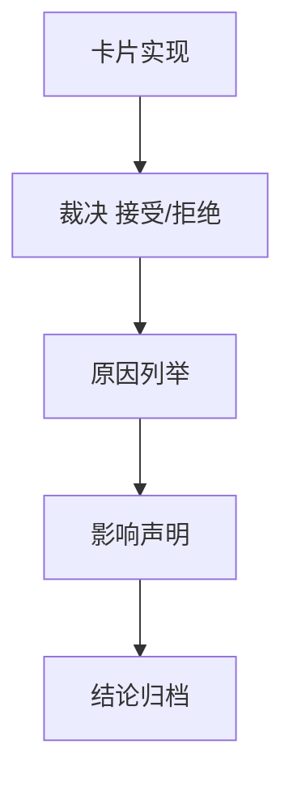

# 结论模板

结论编号：`<待填写>`
日期：`<yyyy-mm-dd>`
状态：`草稿`

## 裁决

- 接受：
- 拒绝：

## 原因

- 原因 1
- 原因 2

## 影响

- 影响 1
- 影响 2

## 结论结构图

```mermaid
flowchart TD
    A[卡片实现] --> B[裁决 接受/拒绝]
    B --> C[原因列举]
    C --> D[影响声明]
    D --> E[结论归档]
```
