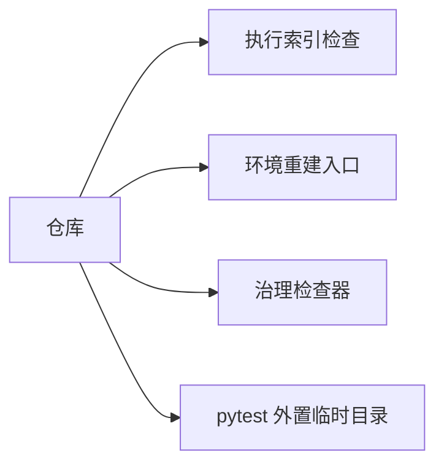

# 治理工具与环境重建结论

结论编号：`01`
日期：`2026-04-09`
状态：`生效中`

## 裁决

- 接受：新仓已经具备最小系统治理工具与本地环境重建入口。
- 拒绝：暂无

## 原因

1. `.codex/skills/lifespan-execution-discipline/` 已落地，具备执行四件套生成与执行索引检查能力。
2. `scripts/system/` 已落地，具备文件长度、中文化、仓库卫生三类治理检查能力。
3. `scripts/setup/rebuild_windows_env.ps1` 已可使用 `D:\miniconda310\python.exe` 成功重建 `.venv`。
4. `pytest` 的缓存和临时目录已经外置到 `H:\Lifespan-temp`，不再回流仓库根目录。
5. 新增入口文件新鲜度治理后，`AGENTS.md`、`README.md`、`pyproject.toml` 与治理入口已保持同步。
6. 最小路径契约测试已经通过，结果为 `4 passed`。

## 影响

1. 新仓后续重构可以在执行索引、证据回填和环境重建约束下继续推进。
2. `pytest` 临时文件不再污染仓库根目录，而是沉到 `H:\Lifespan-temp`。
3. 业务 runner 迁移仍需另开新卡，不包含在本结论内。

## 治理能力图

