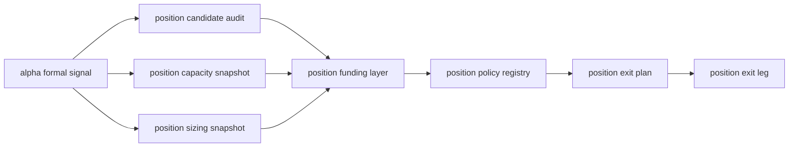

# position 资金管理与退出账本合同

卡片编号：`07`
日期：`2026-04-09`
状态：`已完成`

## 需求

- 问题：
  当前路线图已经把 `position` 定为最接近正式业务施工的一层，但仓库里还没有一份正式 design/spec 去回答下面这些核心问题：
  - 资金管理是否继续混在一张大表里
  - `trim_to_context_cap / final_allowed_position_weight / blocked candidate` 到底落在哪些正式表
  - 立花义正式“测试仓 + 加码”在新系统里是表层二分，还是 `position` 内部动作语义
- 目标结果：
  冻结 `position` 的正式 design/spec/card，明确公共账本层、方法分表层、自然键和动作角色边界，并把路线图里的 `position` 未定项压缩成仓库内正式结论。
- 为什么现在做：
  如果这一层继续悬而不决，`portfolio_plan / trade / system` 都会缺少稳定上游，路线图里的“下一锤”也无法真正落到仓库事实。

## 设计输入

- 设计文档：`docs/01-design/modules/position/01-position-funding-management-and-exit-charter-20260409.md`
- 规格文档：`docs/02-spec/modules/position/01-position-funding-management-and-exit-spec-20260409.md`
- 参考材料：
  - `G:\MarketLifespan-Quant\docs\01-design\modules\position\00-position-charter-20260326.md`
  - `G:\MarketLifespan-Quant\docs\02-spec\modules\position\01-position-spec-20260326.md`
  - `G:\EmotionQuant-gamma\positioning\02-implementation-spec\01-positioning-baseline-and-sizing-spec-20260313.md`
  - `G:\EmotionQuant-gamma\positioning\02-implementation-spec\02-partial-exit-contract-spec-20260314.md`
  - `G:\MarketLifespan-Quant\docs\03-execution\81-position-risk-sizing-baseline-migration-conclusion-20260325.md`
  - `G:\MarketLifespan-Quant\docs\03-execution\82-position-partial-exit-contract-migration-conclusion-20260325.md`
  - `G:\MarketLifespan-Quant\docs\03-execution\291-position-long-only-max-position-contract-reset-card-20260407.md`
  - `G:\MarketLifespan-Quant\docs\03-execution\293-position-real-portfolio-capacity-and-total-cap-reset-card-20260407.md`
  - `G:\MarketLifespan-Quant\docs\03-execution\294-position-positive-weight-and-trim-path-bounded-acceptance-conclusion-20260407.md`

## 任务分解

1. 切片 1：梳理旧仓 `position / positioning / system 291/293/294` 的已定论边界，确认新仓应沿袭的主合同与拒绝事项。
2. 切片 2：补 `position` 正式 design/spec，冻结公共账本层、资金管理分表层、自然键和”测试仓/主仓”新语义。
3. 切片 3：回填 07 的 evidence / record / conclusion，并顺手开 08 草卡，让执行索引切到”表族落库与 bootstrap”。

## 模块边界与数据流图

## 实现边界

- 范围内：
  - `position` 模块正式合同文档
  - 路线图与执行索引同步
  - 07 的执行闭环收口
- 范围外：
  - `src/mlq/position` 正式 schema/bootstrap
  - `alpha -> position` 字段级桥接代码
  - `trade / portfolio_plan / system` 真实消费逻辑

## 收口标准

1. `position` 正式 design/spec 已建立
2. 资金管理分表、自然键和动作角色边界已冻结
3. 07 的证据写完
4. 07 的记录写完
5. 07 的结论写完
6. 已开 08 草卡并切换执行索引
