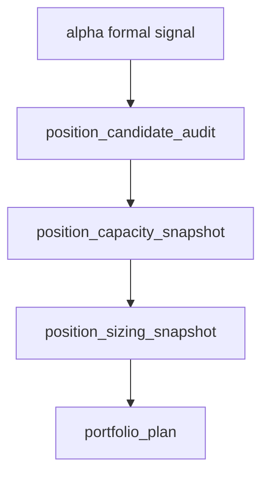

# position 资金管理与退出账本合同 结论

结论编号：`07`
日期：`2026-04-09`
状态：`生效中`

## 裁决

- 接受：`position` 在新仓中的主语正式冻结为“单标的允许仓位账本”，不是“测试仓 / 主仓”的口头二分。
- 接受：`position` 正式采用“公共账本层 + 资金管理方法分表层”的表族结构。
- 接受：立花义正式的“试探建仓 / 确认加码 / 风险收缩 / 最终平仓”被正式吸收为 `entry_leg_role / position_action_decision / exit_reason_code` 语义，而不是另起账户层。
- 接受：`trim_to_context_cap / final_allowed_position_weight / blocked candidate` 必须成为显式账本事实。
- 拒绝：继续把所有资金管理逻辑塞进一张宽表。
- 拒绝：把“测试仓 + 主仓”直接当成新系统顶层边界。
- 拒绝：在没有 carry/open leg 正式真相源前，假装系统已经默认支持连续加码。

## 原因

1. 旧仓已经反复证明，如果 `final_allowed_position_weight` 和 `trim_to_context_cap` 不显式落账，下游几乎无法解释为什么放行、为什么拦截、为什么减仓。
2. 旧 `positioning` 研究线和 `291 / 293 / 294` 执行卡已经把 control baseline、退出腿合同、真实容量约束与 trim 路径分别冻成可沿袭结论，新仓没有必要再回到“先混在一起再慢慢拆”的起点。
3. 立花义正式“分批试探、顺势加码”的经验如果只写成“测试仓 / 主仓”，会把动作语义和账本语义混在一起；只有把它降到 `position` 内部动作角色，后续才可能安全接到 `trade` 与 `portfolio_plan`。

## 影响

1. 路线图中原来关于 `position` 资金管理分表、自然键和"测试仓 + 加码"落点的三处核心未定项，从本轮开始转为仓库内正式合同。
2. `position` 已经具备开 08 的前提，下一步可以直接进入表族落库与 bootstrap，而不是继续围绕命名和分层打转。
3. `portfolio_plan / trade / system` 以后消费 `position` 时，面对的是显式的允许仓位、减仓裁决和退出腿合同，不再只是旧研究线残留的口头语义。

## position 表族结构图

