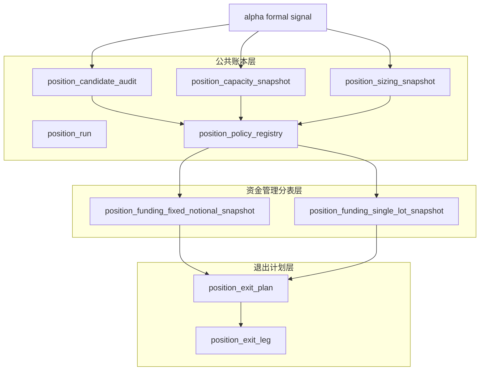

# position 账本表族落库与 bootstrap

卡片编号：`08`
日期：`2026-04-09`
状态：`已完成`

## 需求

- 问题：
  `position` 的正式 design/spec 已经冻结，但新仓还没有把这些表族真正落到 `position` 模块历史账本里，当前仍只有模块 lessons 与执行卡，没有正式 schema/bootstrap 入口。
- 目标结果：
  为 `position` 建立最小正式表族与 bootstrap 入口，至少覆盖公共账本层、`FIXED_NOTIONAL_CONTROL`、`SINGLE_LOT_CONTROL` 与退出计划/退出腿的最小落库，并接通 `alpha formal signal -> candidate/capacity/sizing` 的最小消费入口。
- 为什么现在做：
  07 已经把表族边界、自然键和“测试仓/主仓”的正式语义写死；如果不立刻进入 08，路线图就会停留在“合同已经成立，但仓库里还没有正式落点”的空档期。

## 设计输入

- 设计文档：`docs/01-design/modules/position/01-position-funding-management-and-exit-charter-20260409.md`
- 规格文档：`docs/02-spec/modules/position/01-position-funding-management-and-exit-spec-20260409.md`
- 桥接合同：`docs/02-spec/modules/position/02-alpha-to-position-formal-signal-bridge-spec-20260409.md`

## 任务分解

1. 建立 `position` 公共账本层 schema/bootstrap，包括 `position_run / position_policy_registry / position_candidate_audit / position_capacity_snapshot / position_sizing_snapshot / position_exit_plan / position_exit_leg`。
2. 建立 `position_funding_fixed_notional_snapshot / position_funding_single_lot_snapshot` 最小分表，并把 policy registry 接通。
3. 实现 `alpha formal signal -> position_candidate_audit / position_capacity_snapshot / position_sizing_snapshot` 的最小 in-process 消费入口，并让当前激活 policy 能写入对应 family snapshot。
4. 补最小测试、命令证据和落表核查，确认 08 的 schema/bootstrap 与最小消费入口已满足文档先行门禁。

## 表族结构图

## 实现边界

- 范围内：
  - `position` 模块最小 schema/bootstrap
  - 激活方法的分表落库
  - `alpha formal signal` 的最小 in-process 消费入口
  - 最小验证与执行闭环回填
- 范围外：
  - `probe_entry / confirm_add` 连续加码主线
  - `alpha` 五表族最终字段桥接
  - `portfolio_plan / trade` 的正式消费逻辑

## 收口标准

1. `position` 最小公共账本层已落库
2. 激活方法分表已落库
3. `alpha formal signal -> candidate/capacity/sizing` 最小消费入口已具备
4. 最小测试或落表核查已具备
5. 证据写完
6. 记录写完
7. 结论写完
