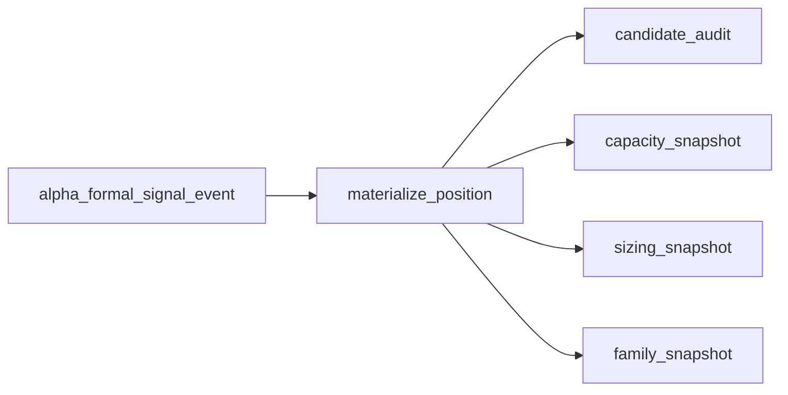

# position 账本表族落库与 bootstrap 结论

结论编号：`08`
日期：`2026-04-09`
状态：`生效中`

## 裁决

- 接受：`position` 最小公共账本层与 `FIXED_NOTIONAL_CONTROL / SINGLE_LOT_CONTROL` 分表已经在新仓正式落库。
- 接受：新仓已经具备 `alpha formal signal -> position_candidate_audit / position_capacity_snapshot / position_sizing_snapshot` 的最小 in-process 消费入口。
- 接受：当前默认 policy seed 已在 `position_policy_registry` 中正式建立，后续 runner 不需要再用口头约定拼 policy 组合。
- 拒绝：把 08 停留在“只有 DDL，没有消费入口”的半成品状态。

## 原因

1. 08 之前，新仓虽然已有 `position` design/spec，但 `src/mlq/position` 仍只有空壳；这会让后续桥接工作继续停在纸面。
2. 本轮已经把 9 张最小表、4 组默认 policy seed、以及最小 formal signal 消费路径一起落下，`position` 第一次从文档层进入可执行层。
3. 单测和 smoke 已证明 admitted / blocked / trim 三类最小路径都能真实落入 `candidate / capacity / sizing / family snapshot`。

## 影响

1. `position` 当前状态从“合同已冻结”推进到“最小 bootstrap 与最小消费入口已建立”。
2. 后续 09 可以直接围绕“真实读取 `alpha` 官方 formal signal、补 market_base 参考价、做 bounded validation”展开，而不必再重搭基础表族。
3. `portfolio_plan / trade / system` 未来消费 `position` 时，已经有正式的最小账本出口，而不是只有文档描述。

## position 最小账本图

