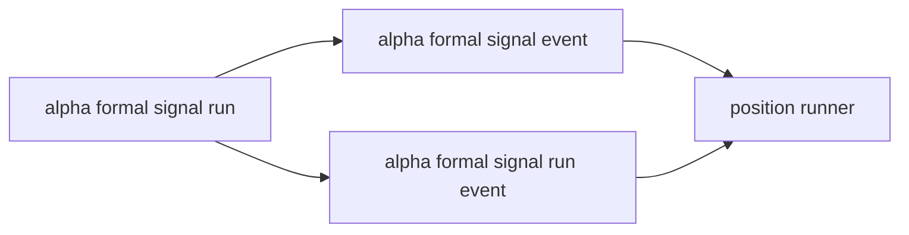

# alpha formal signal 正式出口合同与最小 producer

卡片编号：`10`
日期：`2026-04-09`
状态：`已完成`

## 需求

- 问题：
  `09` 已经把 `position` 消费侧 runner 建起来了，但新仓里还没有 `alpha` 自己的正式 `formal signal producer`。结果是 `position` 只能读一张合同兼容表，`M2 alpha-position 正式桥接成立` 仍然不能收口。
- 目标结果：
  为 `alpha` 补齐正式 `formal signal` 出口合同，最小范围只做：
  `alpha_formal_signal_run / alpha_formal_signal_event / alpha_formal_signal_run_event`
  与最小 producer runner，并在本卡完成后让 `position` runner 直接消费这张新仓官方上游表。
- 为什么现在做：
  当前真实缺口已经从“`position` runner 不存在”切换成“上游 `alpha formal signal` 正式出口不存在”；如果继续深挖 `position` 内部 family 表，只会把真正缺口继续后推。

## 设计输入

- 设计文档：`docs/01-design/modules/alpha/01-alpha-formal-signal-output-charter-20260409.md`
- 规格文档：`docs/02-spec/modules/alpha/01-alpha-formal-signal-output-and-producer-spec-20260409.md`
- 消费侧桥接合同：`docs/02-spec/modules/position/02-alpha-to-position-formal-signal-bridge-spec-20260409.md`
- 消费侧 runner 规格：`docs/02-spec/modules/position/03-position-formal-signal-runner-spec-20260409.md`
- 上轮结论：`docs/03-execution/09-position-formal-signal-runner-and-bounded-validation-conclusion-20260409.md`

## 任务分解

1. 建立 `alpha` 正式 `formal signal` 最小三表合同，并在 `alpha` 账本中完成 bootstrap。
2. 实现最小 producer runner，支持 bounded 读取、按 `instrument` 分批、写入 `run / event / run_event` 与 summary。
3. 让 `position` 正式 runner 直接对接 `alpha_formal_signal_event`，并留下 unit test、bounded smoke、record、conclusion。

## 生产者-消费者图

## 实现边界

- 范围内：
  - `alpha_formal_signal_run / alpha_formal_signal_event / alpha_formal_signal_run_event`
  - `run_alpha_formal_signal_build(...)`
  - `scripts/alpha/run_alpha_formal_signal_build.py`
  - `position` 对官方 `alpha_formal_signal_event` 的真实对接
  - bounded evidence
- 范围外：
  - `position` 新增更多 funding / exit family 表
  - `trade / system` 正式开工
  - `alpha` 全历史 full backfill
  - 为治理脚本去硬拆 `bootstrap.py`

## 收口标准

1. `alpha` 正式最小 `formal signal` 三表已落下。
2. 最小 producer runner 已形成正式脚本入口。
3. `position` runner 已直接消费 `alpha_formal_signal_event`，不再依赖合同兼容表。
4. bounded validation 证据具备。
5. 证据写完。
6. 记录写完。
7. 结论写完。
