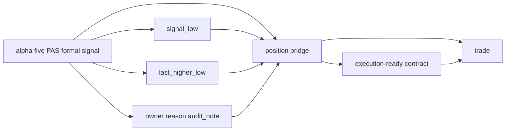

# trade signal anchor contract freeze

卡片编号：`100`
日期：`2026-04-11`
状态：`待执行`

## 需求

- 问题：
  当前 `trade` 运行时虽然已经声明了 `entry_open_minus_signal_low / break_last_higher_low` 等策略标签，但正式账本里没有冻结 `signal_low / last_higher_low` 的跨模块来源与透传合同；同时 `position` 作为 `alpha -> trade` 的唯一正式桥接层也没有被写透。
- 目标结果：
  在 `95` 通过后，冻结 `alpha -> position -> trade` 的信号锚点透传合同：`alpha` 提供正式终审输入，`position` 冻结 execution-ready contract，`trade` 只读消费，不再临时回推业务事实。
- 为什么现在做：
  `100` 是恢复 `trade/system` 卡组的第一张卡，**必须在 `85-malf-alpha-official-truthfulness-and-cutover-gate` 接受后才能启动**；否则 `trade` 会建立在尚未完成官方 cutover 的 upstream 上游之上。

## 设计输入

- 设计文档：
  - `docs/01-design/modules/system/06-trade-signal-anchor-contract-freeze-charter-20260411.md`
- 规格文档：
  - `docs/02-spec/modules/system/06-trade-signal-anchor-contract-freeze-spec-20260411.md`
- 当前锚点结论：
  - `docs/03-execution/95-malf-alpha-official-truthfulness-and-cutover-gate-conclusion-20260418.md`
  - `docs/03-execution/55-pre-trade-upstream-data-grade-baseline-gate-conclusion-20260413.md`
  - `docs/03-execution/42-alpha-family-role-and-malf-alignment-conclusion-20260413.md`
  - `docs/03-execution/45-alpha-formal-signal-producer-hardening-before-position-conclusion-20260413.md`

## 层级归属

- 主层：`position`
- 次层：`trade`
- 上游输入：`alpha` 五 PAS 日线正式 `formal signal`
- 本卡职责：把 `alpha` 已冻结的终审事实桥接成 `position` 的正式仓位计划输入，再下传为 `trade` 的执行输入

## 任务分解

1. 冻结 `signal_low / last_higher_low / owner / reason / audit_note / signal_anchor_contract_version` 的正式来源层，并明确只允许来自官方 `alpha formal signal` 输出。
2. 冻结 `alpha -> position -> trade` 的透传字段与表面，明确 `position` 是唯一桥接层。
3. 明确 `position_candidate / position_entry_plan / execution-ready contract` 各自必须承接哪些 anchor 字段，以及哪些字段只能在 `position` 层冻结。
4. 明确 `trade_execution_plan / trade_position_leg / trade_carry_snapshot` 各自只读哪些 anchor 字段，禁止 `trade` 回读 `alpha` 私有过程或重新解释 PAS verdict。
5. 为 `101 / 102 / 103` 定义稳定输入合同，并回填 execution 文档与索引。

## 信号锚点桥接图

## 实现边界

- 范围内：
  - `docs/01-design/modules/system/06-*`
  - `docs/02-spec/modules/system/06-*`
  - `docs/03-execution/100-*`
  - `alpha / position / trade` 跨模块 anchor 字段合同
  - `position` 作为唯一桥接层的字段冻结边界
- 范围外：
  - 退出账本与 realized pnl 落表
  - 逐日 progression 引擎
  - live/runtime orchestration 语义

## 历史账本约束

- 实体锚点：
  `formal_signal_nk / position_candidate_nk / leg_nk`
- 业务自然键：
  以正式 NK 透传，`run_id` 只做审计。
- 批量建仓：
  对既有 bounded 窗口允许历史补齐透传字段。
- 增量更新：
  新信号只做单向透传。
- 断点续跑：
  中断后允许按正式自然键幂等补写。
- 审计账本：
  审计落在相关模块 run 表与 `100` execution 文档。

## 正式设计清单

| 设计项 | 正式口径 | 不接受情形 |
| --- | --- | --- |
| 来源层 | `signal_low / last_higher_low / owner / reason / audit_note` 只能来自官方五 PAS `alpha_formal_signal_event` 或其冻结的正式衍生列 | `trade` 或 `position` 通过 `market_base`、`malf`、`structure` 或内部 helper 临时回推 |
| 透传路径 | `alpha formal signal -> position candidate/entry plan/execution-ready contract -> trade execution_plan/position_leg` | `trade` 直接跨层回读 `alpha` 私有过程，或 `position` 不落稳就直接透传 |
| 桥接主权 | `position` 是唯一桥接层，负责把 `alpha` verdict 冻结成下游可执行合同 | `trade` 直接拿 `alpha` 事件当执行输入，或 `position` 只做临时 passthrough |
| 自然键绑定 | anchor 字段绑定 `formal_signal_nk / candidate_nk / execution_plan_nk / position_leg_nk` 等正式 NK，`run_id` 不参与业务主键 | 用 run 窗口、执行顺序或文件名识别 anchor |
| 版本治理 | 必须新增 `signal_anchor_contract_version` 或等价版本字段，显式标识 anchor 解释口径 | 靠隐式代码版本漂移 |
| 下游消费 | `101 / 102 / 103` 只读消费 `position` 冻结后的正式透传值，不再重新解释 `signal_low / last_higher_low` 的业务含义 | 在 `trade` 退出或 progression 中二次定义 anchor |

## 实施清单

| 切片 | 实施内容 | 交付物 |
| --- | --- | --- |
| 切片 1 | 盘点五 PAS `alpha` 输出与 `position / trade` 现有字段，列出 anchor 缺口与最终透传表面 | 字段映射表、gap list |
| 切片 2 | 冻结 `signal_low / last_higher_low / owner / reason / audit_note / signal_anchor_contract_version` 的正式字段合同 | 设计/规格裁决、DDL/字段说明 |
| 切片 3 | 明确 `position_candidate / position_entry_plan / execution-ready contract` 的必备 anchor 字段与回填规则 | 目标表族说明、幂等回填规则 |
| 切片 4 | 明确 `trade_execution_plan / trade_position_leg / carry` 的只读 anchor 字段与消费规则 | 目标表族说明、只读消费规则 |
| 切片 5 | 补单元测试与 bounded smoke，验证 `position` 成为唯一桥接层、`trade` 不再回推业务事实 | tests、evidence 命令 |
| 切片 6 | 回填 `record / conclusion / indexes` | execution 闭环文档 |

## A 级判定表

| 判定项 | A 级通过标准 | 阻断条件 | 对下游影响 |
| --- | --- | --- | --- |
| 来源冻结 | `signal_low / last_higher_low / owner / reason / audit_note` 来源唯一且正式 | 来源仍可由 `position/trade` 临时回推 | `101 / 102 / 103` 不可启动 |
| 透传闭环 | `alpha -> position -> trade` 全链可追溯，且 `position` 为唯一桥接层 | 任一层缺字段或语义漂移 | `trade` 事实不可信 |
| 自然键与版本 | NK 与 contract version 稳定可复算 | 依赖 run 级状态 | replay/rematerialize 不可信 |
| 历史回填 | 历史窗口可幂等补齐 anchor 字段 | 只能对新跑批次生效 | 历史 replay 无法成立 |
| 审计证据 | 有测试、smoke、record、conclusion | 只有口头裁决 | 卡不可收口 |

## 收口标准

1. `alpha -> position -> trade` 的信号锚点正式合同成立。
2. `position` 被明确写成唯一桥接层。
3. `101-103` 的正式输入成立。
4. `trade` 明确不再回推业务事实。

