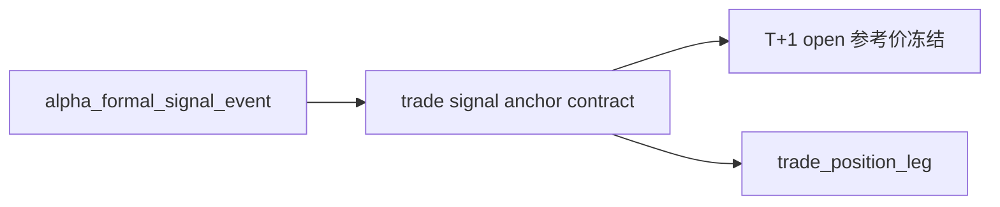

# trade signal anchor contract freeze 结论

结论编号：`100`
日期：`2026-04-11`
状态：`草稿`

## 裁决

- 接受：
- 拒绝：

## 原因

- 原因 1
- 原因 2

## 影响

- 影响 1
- 影响 2

## trade signal anchor 结构图

```mermaid
flowchart LR
    ALPHA[alpha_formal_signal_event] --> ANCHOR[trade signal anchor contract]
    ANCHOR --> TP1[T+1 open 参考价冻结]
    ANCHOR --> TRADE[trade_position_leg]
```
