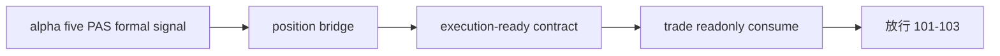

# trade signal anchor contract freeze 结论

结论编号：`100`
日期：`2026-04-11`
状态：`草稿`

## 预设裁决

- 接受：
  当 `alpha -> position -> trade` 的信号锚点正式合同成立，且 `position` 被明确冻结为唯一桥接层时接受。
- 拒绝：
  如果 `trade` 仍可直接回读 `alpha` 私有过程，或 `position` 仍只是临时 passthrough 而不是正式桥接层，则拒绝。

## 预设原因

1. `100` 的本质不是单纯的 `trade` 前置，而是先把 `alpha` 的终审事实稳定桥接为 `position` 的正式仓位计划输入。
2. `101-103` 必须建立在稳定的 `position` 桥接合同上，否则 entry reference price、exit/PnL 与 progression 都会退回运行时临时解释。
3. `84` 已冻结 upstream 主权边界后，`100` 必须继续把下游执行入口也冻结为正式合同。

## 预设影响

1. `101` 可以在明确桥接主权的前提下冻结 `position -> trade` 的执行参考价合同。
2. `102 / 103` 可以只读消费 `position` 冻结后的 execution-ready contract，而不是各自再解释策略锚点。
3. `104 / 105` 可以把 `position` 视为新框架下不可绕过的正式中层。

## 结论结构图

