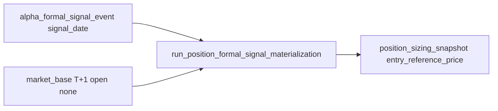

# position entry t-plus-1 open reference price correction 结论

结论编号：`101`
日期：`2026-04-11`
状态：`草稿`

## 裁决

- 接受：
- 拒绝：

## 原因

- 原因 1
- 原因 2

## 影响

- 影响 1
- 影响 2

## T+1 参考价修正图

```mermaid
flowchart LR
    SIG[alpha_formal_signal_event signal_date] --> RUNNER[run_position_formal_signal_materialization]
    MB[market_base T+1 open none] --> RUNNER
    RUNNER --> PS[position_sizing_snapshot entry_reference_price]
```
