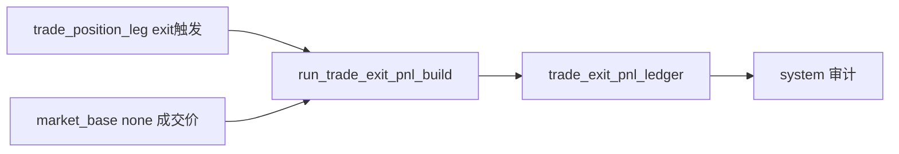

# trade exit pnl ledger bootstrap 结论

结论编号：`102`
日期：`2026-04-11`
状态：`草稿`

## 裁决

- 接受：
- 拒绝：

## 原因

- 原因 1
- 原因 2

## 影响

- 影响 1
- 影响 2

## trade exit PnL 账本图

```mermaid
flowchart LR
    LEG[trade_position_leg exit触发] --> PNL[run_trade_exit_pnl_build]
    MB[market_base none 成交价] --> PNL
    PNL --> EPNL[trade_exit_pnl_ledger]
    EPNL --> SYS[system 审计]
```
