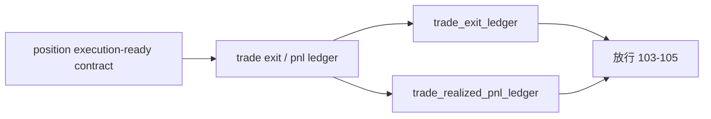

# trade exit pnl ledger bootstrap 结论

结论编号：`102`
日期：`2026-04-11`
状态：`草稿`

## 预设裁决

- 接受：
  当 `trade_exit_ledger / trade_realized_pnl_ledger` 成为正式结果账本，且它们只消费 `position` 冻结后的 execution-ready contract 时接受。
- 拒绝：
  如果 `trade` 仍通过 `alpha / structure / malf` 或运行时 helper 回推退出解释，或 realized pnl 仍停留在 report/summary 临时汇总，则拒绝。

## 预设原因

1. `102` 要冻结的是 `trade` 的结果真值层，而不是再造一个策略解释层。
2. exit / realized pnl 一旦不落正式账本，`103` 的 progression 和 `105` 的 system 审计都没有稳定结果落点。
3. 在新框架下，`trade` 必须只读执行输入，不能重新争夺 trigger/verdict 主权。

## 预设影响

1. `103` 可以把 open leg 推进稳定写入正式 exit / pnl 账本。
2. `104` 可以在真实 smoke 中验证 `trade` 是否只基于正式输入推进。
3. `105` 可以把 exit / pnl 读作正式 child ledger，而不是运行时旁路产物。

## 结论结构图

