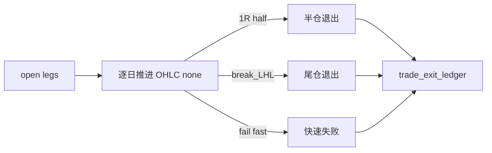

# trade backtest progression runner

卡片编号：`103`
日期：`2026-04-11`
状态：`待执行`

## 需求

- 问题：
  当前系统没有把 `open` 状态的正式仓位腿逐日推进到 `partial/closed` 的 data-grade 正式引擎。
- 目标结果：
  实现基于日线 OHLC 的 `trade` data-grade progression runner，支持快速失败、`1R` 半仓、`break_last_higher_low` 尾仓退出，以及 `work_queue + checkpoint + replay/resume`。
- 为什么现在做：
  只有在 `100-102` 把锚点、entry price、退出账本和 realized pnl 都冻结后，这张卡才具备稳定输入；同时它也是 `104` 真实官方库 smoke 的直接前置。

## 设计输入

- 设计文档：
  - `docs/01-design/modules/system/09-trade-backtest-progression-runner-charter-20260411.md`
- 规格文档：
  - `docs/02-spec/modules/system/09-trade-backtest-progression-runner-spec-20260411.md`
- 当前锚点结论：
  - `docs/03-execution/102-trade-exit-pnl-ledger-bootstrap-conclusion-20260411.md`

## 任务分解

1. 冻结 `trade` progression 的正式 dirty 单元、`work_queue / checkpoint / replay` 语义。
2. 冻结 open leg 逐日推进到 exit/PnL 账本的状态机。
3. 明确历史建仓、每日增量、局部 replay 三种运行模式。
4. 回填 `103` 文档，并为 `104` 提供真实官方库 smoke 清单。

## 流程图

## 实现边界

- 范围内：
  - `docs/01-design/modules/system/09-*`
  - `docs/02-spec/modules/system/09-*`
  - `docs/03-execution/103-*`
  - `trade progression` 的 queue/checkpoint/replay/freshness 设计
- 范围外：
  - 真实官方库 smoke 证据归档本身（属于 `104`）
  - system orchestration

## 历史账本约束

- 实体锚点：
  `position_leg_nk`
- 业务自然键：
  `progression_step_nk / queue_nk / checkpoint_nk`
- 批量建仓：
  支持对历史 open legs 按 `portfolio/date/instrument` 切片逐日推进
- 增量更新：
  只推进脏 open legs 或受价格/anchor 变更影响的 legs
- 断点续跑：
  必须正式交付 `trade_work_queue + trade_checkpoint + replay/resume`
- 审计账本：
  `trade_run / trade progression ledger / exit / realized pnl / freshness audit`

## 正式设计清单

| 设计项 | 正式口径 | 不接受情形 |
| --- | --- | --- |
| dirty 单元 | 以 `portfolio_id + position_leg_nk + progression_date` 或等价正式单元挂脏 | 只按整组合或整窗口粗粒度重跑 |
| queue/checkpoint | 必须有 `trade_work_queue / trade_checkpoint`，可解释“跑到哪一天、哪条腿” | 只有 run，没有 resume 语义 |
| 逐日推进状态机 | open leg 基于 `market_base(none)` 逐日推进，命中规则后写 `exit / pnl` 正式账本 | 在内存里推进后只改最后状态 |
| replay/resume | 支持只重放脏腿、脏日期范围，不全量重跑历史 | replay 退化成 full rebuild |
| freshness | 提供 `trade_freshness_audit` 或等价读数，说明最新推进日期与预期日期 | 无法判断 trade 是否跑齐 |
| 下游桥接 | `104 / 105` 只消费正式 progression 账本与 readout，不读取私有中间过程 | 真实 smoke/system 依赖内存态 |

## 实施清单

| 切片 | 实施内容 | 交付物 |
| --- | --- | --- |
| 切片 1 | 设计 `trade_work_queue / trade_checkpoint / progression_step ledger / freshness_audit` | DDL、字段说明 |
| 切片 2 | 冻结逐日推进状态机：快失败、1R 半仓、尾仓退出、时间止损 | 状态机图与规则表 |
| 切片 3 | 定义 bootstrap / incremental / replay 三种运行模式与 CLI 参数 | runner 入口与参数契约 |
| 切片 4 | 补测试与 bounded smoke，验证 resume、rematerialize、幂等 upsert | tests、evidence 命令 |
| 切片 5 | 为 `104` 生成真实官方库 smoke 清单与预期输出 | smoke checklist |
| 切片 6 | 回填 `record / conclusion / indexes` | execution 闭环文档 |

## A 级判定表

| 判定项 | A 级通过标准 | 阻断条件 | 对下游影响 |
| --- | --- | --- | --- |
| runner data-grade 化 | `trade` 具备 queue/checkpoint/replay/resume/freshness | 仍是最小 runtime | `104/105` 不可启动 |
| 逐日推进真值 | progression 逐日写正式账本并驱动 exit/PnL | 只保留最终状态 | 审计与复算失效 |
| 历史回放与增量 | 支持切片 bootstrap 与日更增量 | 只能全量回放 | 大数据量不可运行 |
| 审计闭环 | run、checkpoint、freshness、record、conclusion 完整 | 只有代码/DDL 没证据 | 卡不可收口 |
