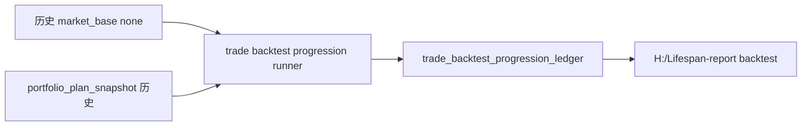

# trade backtest progression runner 结论

结论编号：`103`
日期：`2026-04-11`
状态：`草稿`

## 裁决

- 接受：
- 拒绝：

## 原因

- 原因 1
- 原因 2

## 影响

- 影响 1
- 影响 2

## backtest progression runner 图

```mermaid
flowchart LR
    HIST[历史 market_base none] --> BT[trade backtest progression runner]
    PP[portfolio_plan_snapshot 历史] --> BT
    BT --> PROG[trade_backtest_progression_ledger]
    PROG --> REPORT[H:/Lifespan-report backtest]
```
