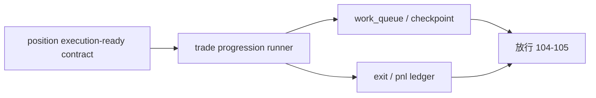

# trade backtest progression runner 结论

结论编号：`103`
日期：`2026-04-11`
状态：`草稿`

## 预设裁决

- 接受：
  当 `trade` 具备 `work_queue / checkpoint / replay / resume / freshness` 的 data-grade progression 能力，且 progression 只消费 `position` 冻结后的执行合同与 `102` 正式结果账本时接受。
- 拒绝：
  如果 progression 仍依赖 `alpha` 私有过程、回读结构解释，或失败后只能从头重跑，则拒绝。

## 预设原因

1. `103` 的职责是把 `trade` 升级为执行推进真值层，而不是让 `trade` 变成策略二次判断层。
2. 没有 data-grade progression，`104` 的真实 smoke 和 `105` 的 orchestration 都无法建立在可续跑、可复算的执行链上。
3. `trade` 的 queue/checkpoint/freshness 必须与正式结果账本连成闭环，才能称为正式执行层。

## 预设影响

1. `104` 可以第一次在真实 bounded 链条中验证 `trade` 的正式推进能力。
2. `105` 可以只读消费正式 progression readout，而不依赖内存态或临时日志。
3. `trade` 在新框架下完成从最小 runtime 到 data-grade 执行真值层的升级。

## 结论结构图

