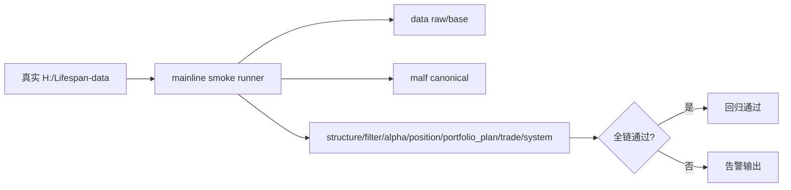

# mainline real data smoke regression 结论

结论编号：`104`
日期：`2026-04-11`
状态：`草稿`

## 裁决

- 接受：
- 拒绝：

## 原因

- 原因 1
- 原因 2

## 影响

- 影响 1
- 影响 2

## smoke regression 流程图

```mermaid
flowchart LR
    REAL[真实 H:/Lifespan-data] --> SMOKE[mainline smoke runner]
    SMOKE --> DATA[data raw/base]
    SMOKE --> MALF[malf canonical]
    SMOKE --> DOWN[structure/filter/alpha/position/portfolio_plan/trade/system]
    DOWN --> PASS{全链通过?}
    PASS -->|是| OK[回归通过]
    PASS -->|否| FAIL[告警输出]
```
