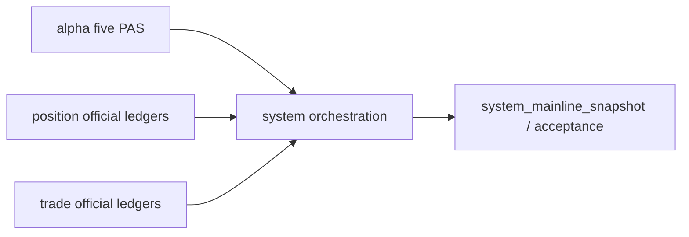

# system runtime / orchestration bootstrap 结论

结论编号：`105`
日期：`2026-04-11`
状态：`待执行`

## 预设裁决

- 接受：
  当 `system` 已基于 `85` 后新 upstream contract 建立正式 orchestration / acceptance / freeze 入口，且 child-run fingerprint 能追溯到五 PAS `alpha`、正式 `position` 与正式 `trade` 时接受。
- 拒绝：
  如果 `system` 仍只是 bounded readout，或 orchestration 无法说明冻结结果到底建立在哪套官方上游之上，则拒绝。

## 预设原因

1. `105` 不是抽象“大编排器”卡，而是新框架下的正式审计与冻结入口卡。
2. 只有当 `system` 的 child-run fingerprint 能准确追溯 `alpha / position / trade` 官方账本时，`system_mainline_snapshot` 才有可审计意义。
3. `104` 端到端 smoke 只是验证链条能跑，`105` 才是把这条链正式提升为 orchestration / acceptance contract。

## 预设影响

1. 接受后，`system` 才真正从 readout 层升级为正式 orchestration 层。
2. 全链冻结结果将能够明确追溯到五 PAS `alpha`、正式 `position` 与正式 `trade`。
3. `100-105` 卡组在新框架下完成从桥接、执行到全链冻结的完整闭环。

## 结论结构图

