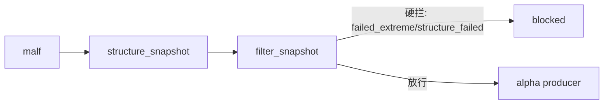

# structure/filter 正式分层与最小 snapshot 结论

结论编号：`11`
日期：`2026-04-09`
状态：`生效中`

## 裁决

- 接受：新仓已具备最小正式 `structure` 三表、`filter` 三表，以及对应 bounded runner 脚本入口。
- 接受：`filter` 当前最小正式硬门只阻断 `failed_extreme / structure_failed`，对 `stalled / unknown` 保持保守放行，不把研究观察误升为硬拦截。
- 接受：`alpha` 官方 producer 默认上游已切到 `alpha trigger + filter_snapshot + structure_snapshot`，不再默认回读旧 `malf` 兼容准入字段。
- 接受：`position` 仍直接消费 `alpha_formal_signal_event`，本轮没有回头扩 `position` 内部表族。
- 拒绝：把本轮结果表述成“`structure / filter / alpha` 全量历史家族已经完成”或“`trade / system` 已打通主线”。

## 原因

1. `10` 已经收口 `alpha -> position` 官方桥接，真实剩余阻塞确实在 `malf -> structure -> filter -> alpha` 这段正式上游。
2. bounded 单元测试证明：
   - `structure` 能稳定写入 `run / snapshot / run_snapshot`
   - `filter` 能以最小硬门生成官方准入快照
   - `alpha` 能直接消费新的官方 snapshot 上游并继续被 `position` 正常消费
3. 当前最小 filter 规则只阻断明确失败结构，符合“别把机会硬挡掉太多”的正式方向。

## 影响

1. 系统主链第一次从"只有 alpha + position"扩展成"malf -> structure -> filter -> alpha -> position"的正式最小连续链。
2. 后续 `alpha` 正式 producer 已经可以直接从官方 `filter_snapshot` 和 `structure_snapshot` 拿上游，不必再自己维护独立的 context 字段。
3. `filter` 的最小硬门准入已经固化：只拦 `failed_extreme / structure_failed`，对 `stalled / unknown` 保守放行，研究边界仍开放。

## structure/filter 最小链路图

