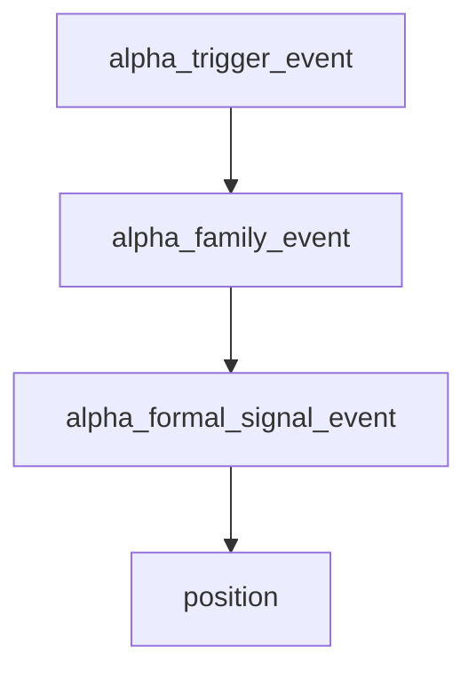

# alpha trigger ledger 与五表族最小物化结论

结论编号：`12`
日期：`2026-04-09`
状态：`生效中`

## 裁决

- 接受：新仓 `alpha` 已具备最小正式 `trigger ledger` 三表与 bounded runner，正式入口为 `scripts/alpha/run_alpha_trigger_ledger_build.py`。
- 接受：`alpha trigger ledger` 已在 `H:\Lifespan-data\alpha\alpha.duckdb` 完成真实 bounded pilot，不再停留在 `H:\Lifespan-temp` smoke。
- 接受：重复运行已显式证明 `inserted / reused / rematerialized` 三种动作都成立，`space-for-time` 已从设计原则进入正式能力。
- 接受：`alpha_formal_signal_event.source_trigger_event_nk` 已稳定引用官方 `alpha_trigger_event.trigger_event_nk`，`trigger ledger -> formal signal` 的正式上游关系成立。
- 拒绝：把本轮结果表述成“五家族全部细节表已全部正式化”或“full-market 全历史 backfill 已完成”。
- 拒绝：把本轮结果表述成“可以直接跳过 `formal signal` 让下游消费 `trigger ledger`”。

## 原因

- `11` 已经收口 `structure / filter` 最小 snapshot，本轮真正剩余的主线空白就是 `alpha` 内部正式中间账本层。
- 单元测试与正式 pilot 共同证明：`alpha` 不但能写 trigger 事实，而且能在相同自然键下复用既有事实，并在上游快照语义变化时进行复物化。
- 正式库 readout 证明 `alpha_trigger_event` 已不再是一次性临时结果，而是可以被 `alpha_formal_signal_event` 稳定引用的历史账本层。

## 影响

- `alpha` 当前已经从“只有 formal signal 官方出口”推进到“trigger ledger + formal signal 两级正式账本”。
- 后续继续扩 `alpha` 时，应优先在当前 trigger ledger 之上继续细化五家族专表、trace 或 detector contract，而不是回头扩 `position` 来掩盖上游缺口。
- 下一张正式主线卡仍应围绕 `alpha` 细化或其紧邻下游展开，但不应倒退到 `temp-only` 口径。

## alpha 三级账本图

