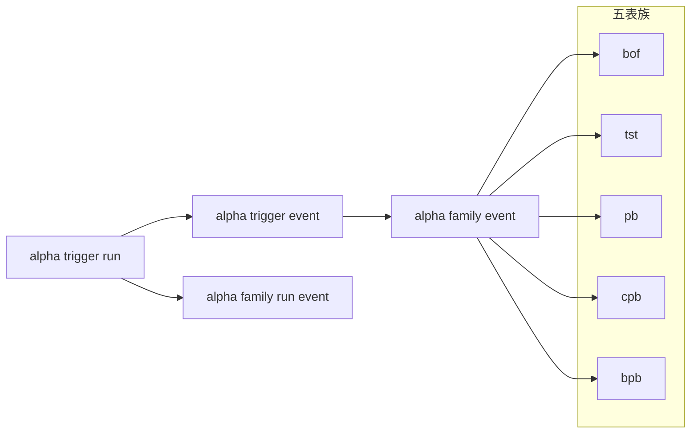

# alpha 五表族共享合同与 family ledger bootstrap
卡片编号：`13`
日期：`2026-04-09`
状态：`待实施`

## 需求
- 问题：
  `12` 已经收口 `alpha_trigger_run / event / run_event`，让 `alpha` 官方共享 trigger 事实层正式成立。
  当前真正还空着的，不是回头扩 `position`，也不是直接跳 `portfolio_plan / trade / system`，而是 `alpha` 里 `bof / tst / pb / cpb / bpb` 五表族自己的 family-specific 正式 ledger 仍未在新仓落稳。
- 目标结果：
  为新仓开出 `alpha` 内部下一层最小正式 family ledger，只先做：
  `alpha_family_run / alpha_family_event / alpha_family_run_event`
  与五家族共享最小 contract、bounded runner、至少一到两个核心 family 的 official pilot，以及 `inserted / reused / rematerialized` 复跑验证。
- 为什么现在做：
  `12` 解决的是 `alpha` 的共享 trigger 事实层，
  `13` 应该解决的是五表族自己的最小正式解释层。
  如果这一步继续后推，主线会重新滑回“围着 `position` 打转”或“过早跳下游”，而不是继续把 `alpha` 最有价值的遗产补厚成正式历史账本。

## 设计输入

- `docs/01-design/modules/alpha/00-alpha-module-lessons-20260409.md`
- `docs/01-design/modules/alpha/01-alpha-formal-signal-output-charter-20260409.md`
- `docs/01-design/modules/alpha/02-alpha-trigger-ledger-and-five-table-family-minimal-materialization-charter-20260409.md`
- `docs/01-design/modules/alpha/03-alpha-five-table-family-shared-contract-and-family-ledger-bootstrap-charter-20260409.md`
- `docs/02-spec/modules/alpha/01-alpha-formal-signal-output-and-producer-spec-20260409.md`
- `docs/02-spec/modules/alpha/02-alpha-trigger-ledger-and-five-table-family-minimal-materialization-spec-20260409.md`
- `docs/02-spec/modules/alpha/03-alpha-five-table-family-shared-contract-and-family-ledger-bootstrap-spec-20260409.md`
- `docs/03-execution/12-alpha-trigger-ledger-and-five-table-family-minimal-materialization-conclusion-20260409.md`
- `G:\MarketLifespan-Quant\docs\01-design\modules\alpha\04-pas-five-trigger-ledger-and-incremental-materialization-reset-20260408.md`
- `G:\MarketLifespan-Quant\docs\01-design\modules\alpha\05-pas-full-market-five-trigger-ledger-backfill-reset-20260408.md`
- `G:\MarketLifespan-Quant\docs\01-design\modules\alpha\06-pas-code-ledger-reset-and-2010-pilot-20260408.md`
- `G:\EmotionQuant-gamma\gene\03-execution\09-phase-g6-bof-pb-cpb-conditioning-card-20260316.md`
- `G:\EmotionQuant-gamma\gene\03-execution\16-phase-gx5-two-b-window-semantics-refactor-card-20260317.md`
- `G:\EmotionQuant-gamma\gene\03-execution\17-phase-gx6-123-three-condition-refactor-card-20260317.md`

## 任务分解

1. 冻结五表族共享 contract 与 family ledger 最小正式合同。
   - 明确 `alpha_family_run / event / run_event` 三表、自然键、审计字段与 `inserted / reused / rematerialized` 动作口径。
   - 明确五家族共享字段组如何容纳 `bof / tst / pb / cpb / bpb` 的最小 family payload。
2. 建立 bounded family materialization runner 与正式 pilot 口径。
   - 只允许 bounded window / bounded instrument slice / bounded family scope 方式落库。
   - 本轮必须真实写入 `H:\Lifespan-data\alpha\alpha.duckdb`，不允许停留在 temp-only。
3. 验证 `alpha_trigger_event -> alpha_family_event` 的正式上游关系。
   - 证明官方 trigger 事实能被 family ledger 稳定引用。
   - 证明重复运行时能正确区分 `inserted / reused / rematerialized`。
4. 先在一到两个核心 family 上证明合同可执行。
   - 不追求一次覆盖五个 family 的全部最终细节。
   - 先用最小 family ledger bootstrap 证明 schema、rerun 和 bounded pilot 成立。

## 五表族结构图

## 实现边界

- 范围内：
  - `alpha_family_run / alpha_family_event / alpha_family_run_event`
  - 五家族共享最小字段组与自然键
  - family bounded runner 与脚本入口
  - 一次真实写入 `H:\Lifespan-data` 的 official pilot
  - bounded evidence、正式库 readout、rerun 审计
- 范围外：
  - 回头扩 `position`
  - 直接开工 `portfolio_plan / trade / system`
  - 五家族全部细节专表一次性补齐
  - full-market 全历史 family backfill
  - 让下游直接消费 family ledger 充当交易主语义

## 收口标准

1. 五表族共享 contract 与 family ledger 最小三表成立。
2. 正式 pilot 真实写入 `H:\Lifespan-data\alpha\alpha.duckdb`。
3. 至少一到两个核心 family 已完成最小 bootstrap 与 readout。
4. 复跑验证能给出 `inserted / reused / rematerialized` 明确统计。
5. `alpha_trigger_event -> alpha_family_event` 对接关系成立。
6. 证据写完。
7. 记录写完。
8. 结论写完。
