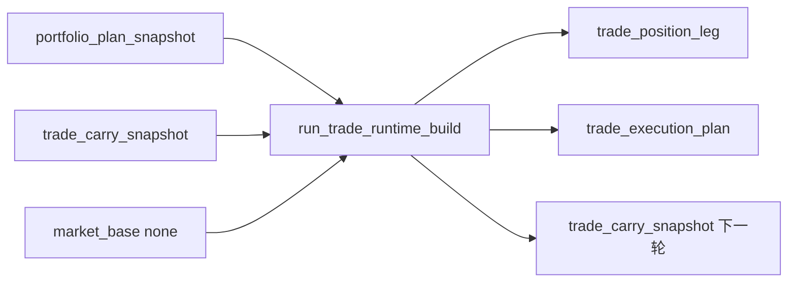

# trade 最小 runtime 账本与 portfolio_plan 桥接结论

结论编号：`15`
日期：`2026-04-10`
状态：`生效中`

## 裁决

- 接受：新仓 `trade_runtime` 已具备最小正式五表、官方 bounded runner 与脚本入口，正式入口为 `scripts/trade/run_trade_runtime_build.py`。
- 接受：`portfolio_plan -> trade` 官方桥接已成立，`trade` 只消费官方 `portfolio_plan_snapshot`、官方 `market_base.stock_daily_adjusted` 与上一轮 `trade_carry_snapshot`，不回读 `alpha`/`position` 内部临时过程。
- 接受：`planned_entry / blocked_upstream / planned_carry` 已成为执行层正式事实；`trade_position_leg` 与 `trade_carry_snapshot` 已把 open leg 与 carry 延续显式落表。
- 接受：`T+1 开盘入场 / 1R / 半仓止盈 / 快速失败 / trailing / 时间止损` 已冻结进 `trade_execution_plan` 的正式 policy 字段。
- 接受：`H:\Lifespan-data\trade\trade_runtime.duckdb` 已完成真实 bounded pilot，`main_book` 给出 `inserted` 与 `reused`，`trade_pilot_book` 给出受控 `rematerialized`。
- 拒绝：把本轮结果表述成“trade 完整 exit/replay/system 总装已建成”。
- 拒绝：把 carry 继续留在口头描述或 temp-only 结果里，不落正式账本。

## 原因

- `14` 完成后，主线真正缺口已经转到执行层事实与持仓延续，而不是继续扩写 `portfolio_plan`。
- 本轮代码、单测、正式 pilot 与账本 readout 共同证明：
  - 组合裁决能够稳定桥接成执行意图；
  - retained open leg 能够跨 run 延续；
  - 执行层也具备 `inserted / reused / rematerialized` 审计能力。
- 为了不污染卡 14 既有 `main_book` 官方事实，本轮用独立 `trade_pilot_book` 做了受控 rematerialized 验证。

## 影响

- 新仓正式主线已从
  `data -> malf -> structure -> filter -> alpha -> position -> portfolio_plan`
  推进到
  `data -> malf -> structure -> filter -> alpha -> position -> portfolio_plan -> trade`。

## trade runtime 数据流图

- 当前执行区主线卡片已清零；若后续进入 `system`，必须重新开卡，不允许直接绕过执行区闭环去改 `src/`。
- `trade_runtime` 现已能正式回答：
  - 哪些组合计划进入 `trade`
  - 下一交易日准备怎么入场
  - 哪些 open leg 还在继续持有
  - 下一轮应该 carry 什么持仓状态
