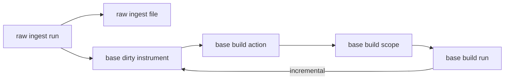

# raw/base 强断点与脏标的物化增强

卡片编号：`17`
日期：`2026-04-10`
状态：`草稿`

## 需求

- 问题：
  `raw_market` 现在已经具备文件级断点雏形，`market_base` 也已经能做基础增量物化，但两者都还缺少“强断点、强续跑”的正式运行账本。
  具体表现为：
  - `raw` 没有显式 `run / file` 账本，中途中断后只能从结果表反推。
  - `base` 没有自己的 `build_run / dirty_queue / scope_action`，日常更新还不是“只消费脏标的”的正式模式。
- 目标结果：
  为 `raw/base` 单独补一条增强线，只处理：
  - `raw_ingest_run / raw_ingest_file`
  - `base_build_run / base_build_scope / base_build_action`
  - `base_dirty_instrument`
  - `full / incremental` 两种正式 runner 模式
- 为什么现在做：
  当前 `raw/base` 已经具备全量建库能力，正是把“能跑”提升到“又快又稳”的时点。
  这件事不应混回 `16`，也不应提前和 `malf` 合同讨论绑死，因此需要独立增强卡。

## 设计输入

- 设计文档：
  - `docs/01-design/modules/data/01-tdx-offline-raw-and-market-base-bridge-charter-20260410.md`
  - `docs/01-design/modules/data/02-raw-base-strong-checkpoint-and-dirty-materialization-charter-20260410.md`
- 规格文档：
  - `docs/02-spec/modules/data/01-tdx-offline-raw-and-market-base-bridge-spec-20260410.md`
  - `docs/02-spec/modules/data/02-raw-base-strong-checkpoint-and-dirty-materialization-spec-20260410.md`
- 当前锚点结论：
  - `docs/03-execution/16-data-malf-minimal-official-mainline-bridge-conclusion-20260410.md`

## 任务分解

1. 建立 `base` 运行账本与脏标的队列。
   - 新增 `base_build_run / base_build_scope / base_build_action / base_dirty_instrument`
   - 让 `run_market_base_build(...)` 支持 `full / incremental`
2. 建立 `raw` 运行账本。
   - 新增 `raw_ingest_run / raw_ingest_file`
   - 让 `run_tdx_stock_raw_ingest(...)` 显式记录文件级动作、错误与续跑结果
3. 补库级硬约束与清理脚本。
   - 处理历史脏行
   - 补唯一约束、关键 `NOT NULL`
   - 提供 bounded validation 与 readout

## 增量物化与断点图

## 实现边界

- 范围内：
  - `src/mlq/data/*`
  - `scripts/data/*`
  - `tests/unit/data/*`
  - `docs/01-design/modules/data/*`
  - `docs/02-spec/modules/data/*`
  - `docs/03-execution/17-*`
- 范围外：
  - `malf` 输入合同改写
  - 复权因子账本
  - corporate action 账本
  - 指数、板块正式下游表增强

## 收口标准

1. `base` 已具备 `dirty queue + build run ledger`，并能区分 `full / incremental`
2. `raw` 已具备 `run / file ledger`
3. 全量建库与日常增量各至少有一轮 bounded evidence
4. 库级约束与脏历史清理方案已冻结到正式口径
5. 证据写完
6. 记录写完
7. 结论写完
