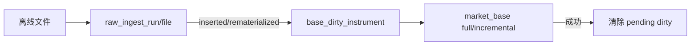

# raw/base 强断点与脏标的物化增强 结论

结论编号：`17`
日期：`2026-04-10`
状态：`生效中`

## 裁决

- 接受：`raw_market` 已升级为文件级运行账本，`raw_ingest_run / raw_ingest_file` 可以作为正式 run 审计、失败定位和续跑锚点。
- 接受：`market_base` 已升级为脏标的增量账本，`base_dirty_instrument / base_build_run / base_build_scope / base_build_action` 可以作为正式增量物化与动作审计锚点。
- 接受：`run_tdx_stock_raw_ingest(...)` 的 `force_hash / continue_from_last_run` 已纳入正式合同。
- 接受：`stock_file_registry.file_nk`、`stock_daily_bar.bar_nk`、`stock_daily_adjusted(code, trade_date, adjust_method)` 与 `base_dirty_instrument.dirty_nk` 的唯一约束与关键 `NOT NULL` 已冻结为正式库级口径。
- 拒绝：继续把 `raw/base` 视作“能跑但没有强断点”的临时桥接层。

## 原因

- 已实现 `base_dirty_instrument / base_build_run / base_build_scope / base_build_action`，并让 `run_market_base_build(...)` 支持 `full / incremental` 双模式。
- 已实现 `raw_ingest_run / raw_ingest_file`，并让 `run_tdx_stock_raw_ingest(...)` 对 `inserted / skipped_unchanged / rematerialized / failed` 做显式记录，并自动标记 `base_dirty_instrument`。
- 已实现 `force_hash / continue_from_last_run`，使 `raw` 既能在显式指定时做更强文件指纹校验，也能从最近一次失败 run 中续跑未完成文件。
- 已在 bootstrap 中补齐历史脏数据清理、唯一约束与关键 `NOT NULL` 升级，并调整 raw/base 物化路径以兼容唯一索引。
- `tests/unit/data/test_data_runner.py` 已覆盖 dirty queue 消费、raw run/file 落账、失败文件审计、强指纹、失败续跑、dirty queue 自动联动与约束升级。
- `H:\Lifespan-report\data\card17\official-readout-001.json` 已证明正式 `H:\tdx_offline_Data -> H:\Lifespan-data` 路径上，`raw full / raw incremental / base full / base incremental` 均可留正式 run 读数。
- `H:\Lifespan-report\data\card17\controlled-readout-001.json` 已证明在受控 bounded replay 中，`force_hash` 可以识别内容变化，`continue_from_last_run` 可以只续跑最近失败 run 中未完成文件。
- `check_execution_indexes.py --include-untracked` 与 `check_doc_first_gating_governance.py` 已在收口后重新通过，执行索引与 doc-first gating 口径保持同步。

## 影响

- 当前最新已生效结论锚点推进到 `17`，后续 `data` 正式实现应默认建立在这套强断点与 dirty queue 合同之上。
- 当前若要做增量 `base` 物化，已可通过 `raw` 自动联动或 `mark_base_instrument_dirty(...)` 显式写入口写入 dirty queue 后运行 `incremental` 模式。
- 当前 `raw` 成功 ingest 会自动把 `inserted / rematerialized` 标的推入 dirty queue；`base full` 成功后会自动清理其覆盖范围内的 pending dirty。
- 当前若要排查 `raw` 中断或异常，已可直接读取 `raw_ingest_run / raw_ingest_file`，不必再从结果表反推。

## raw/base 增量机制图

