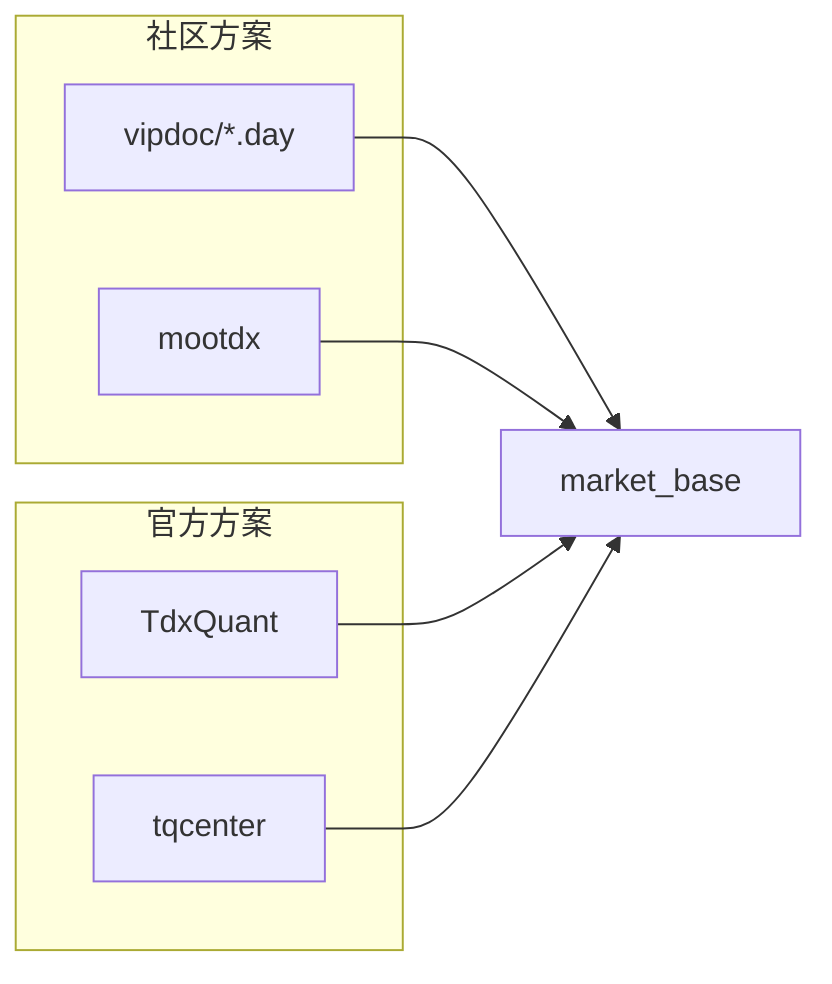

# raw/base 每日复权增量更新方案选型

卡片编号：`18`
日期：`2026-04-10`
状态：`草稿`

## 需求

- 问题：
  卡 `17` 已经把当前 `raw/base` 的正式文本导入链路和“批量更新 / 强断点 / 断点续跑 / 增量更新”能力补齐，但每日更新仍依赖文本文件导出。
  现在需要研究第二阶段的正式源头，判断下面两类方案到底哪一种更适合作为 `raw/base` 的每日联动增量更新入口：
  - `vipdoc/*.day` 本地二进制直读，必要时辅以 `mootdx` 补源
  - 通达信官方 `TdxQuant / tqcenter` 接口
- 目标结果：
  开出一张正式研究卡，冻结：
  - 两类候选方案的正式比较标准
  - 与现有 `raw_market / market_base` 历史账本契约的对接要求
  - 后续 bounded probe、风险登记与最终裁决的收口路径
- 为什么现在做：
  当前 `raw/base` 第一阶段已经成立，正适合把“每日无感更新”单独抽成第二阶段源头选型问题。
  这件事同时牵涉复权口径、断点续跑、增量更新与市场覆盖，不能继续散落在聊天或临时脚本里。

## 设计输入

- 设计文档：
  - `docs/01-design/modules/data/02-raw-base-strong-checkpoint-and-dirty-materialization-charter-20260410.md`
  - `docs/01-design/modules/data/03-daily-raw-base-fq-incremental-update-source-selection-charter-20260410.md`
- 规格文档：
  - `docs/02-spec/modules/data/02-raw-base-strong-checkpoint-and-dirty-materialization-spec-20260410.md`
  - `docs/02-spec/modules/data/03-daily-raw-base-fq-incremental-update-source-selection-spec-20260410.md`
- 当前锚点结论：
  - `docs/03-execution/17-raw-base-strong-checkpoint-and-dirty-materialization-conclusion-20260410.md`

## 任务分解

1. 整理两类候选方案的正式输入。
   - 固化社区方案与官方方案的来源、边界、依赖和已知约束
   - 明确哪些信息来自官方文档，哪些只是社区经验
2. 建立正式比较标准并做 bounded probe。
   - 分别验证复权能力、北交所 / ETF 覆盖、每日增量路径、断点续跑与环境依赖
   - 记录哪一类 ledger 主语更容易落进现有 `raw/base` 契约
3. 输出正式裁决。
   - 明确推荐主路径、备选路径和拒绝项
   - 如果需要进入实现，再开后续实现卡，不直接在本卡偷跑大规模重写

## 源头选型对比图

## 实现边界

- 范围内：
  - `docs/01-design/modules/data/03-*`
  - `docs/02-spec/modules/data/03-*`
  - `docs/03-execution/18-*`
  - 与候选方案相关的 bounded research 与验证证据
- 范围外：
  - 直接替换卡 `17` 已生效入口
  - `malf` 或下游模块改造
  - corporate action 总账设计
  - 未经开卡批准的大规模 `src/mlq/data` 重写

## 收口标准

1. 两类候选方案的正式输入、边界和风险已写入 design/spec
2. 至少形成一轮官方资料整理与 bounded probe 证据
3. 证据写完
4. 记录写完
5. 结论写完，并明确主路径 / 备选路径 / 拒绝项
