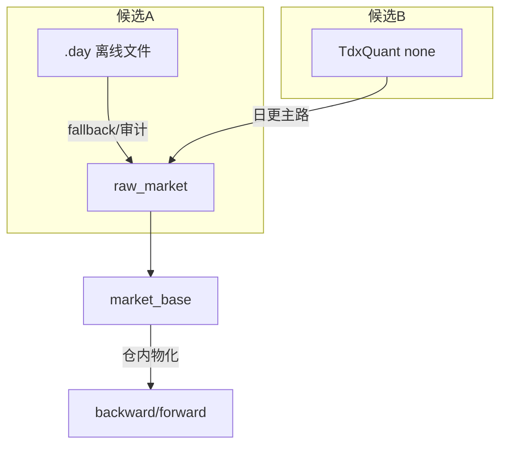

# raw/base 每日复权增量更新方案选型 结论

结论编号：`18`
日期：`2026-04-10`
状态：`草稿`

## 裁决

- 暂不接受：候选 A（`.day` 本地直读）作为 `raw/base` 第二阶段“唯一每日主路径”。
- 暂不接受：候选 B（官方 `TdxQuant`）在当前状态下直接替换卡 `17` 已生效的正式入口。
- 阶段性倾向：
  - 若后续能补齐 universe 枚举合同、run/path 合同，并把复权留在仓内可审计物化层，候选 B 更可能成为“每日联动增量更新”的主源头。
  - 候选 A 更适合作为“本地文件回放 / 审计 / 离线兜底”的 sidecar 或 fallback 路线。
  - 当前不接受把 `TdxQuant(front/back)` 直接等同于正式 `raw_forward / raw_backward`。

## 原因

- 候选 A 虽已证明技术上可直接读取 `.day`，但本轮样本显示：
  - `000001.SZ / 510300.SH / 920021.BJ` 的 `.day` 最后记录都停在 `2026-04-03`
  - `430017.BJ` 的 `.day` 最后记录停在 `2025-09-30`
  - 相对当前日期 `2026-04-10`，它尚未证明自己具备“每日收盘后自动刷新到最新交易日”的稳定能力
- 候选 B 在正确使用时已表现出明显优势：
  - 在支持 TQ 的终端已启动、并用 `PYPlugins/user/*.py` 形式的唯一策略路径初始化后，可真实读取 `000001.SZ`、`510300.SH`、`920021.BJ` 到 `2026-04-10` 的 OHLCV
  - `get_stock_info(...)` 也能对沪深、ETF、北交所样本返回非空基础信息
  - 这说明候选 B 在“每日新鲜度”和“市场覆盖”上比当前 `.day` 样本更接近第二阶段目标
- 但候选 B 仍存在三个不能跳过的正式风险：
  - `path` 更像 run 标识而不是普通目录；同一路径重复初始化会触发 `返回ID小于0`
  - `get_stock_list(market='0'/'1'/'2')` 当前语义异常，不能直接作为正式 universe 枚举合同
  - `dividend_type='none' / 'front' / 'back'` 当前没有证明能稳定映射到正式复权列
- 本轮“已知除权样本集”专项 probe 已进一步证明，官方复权语义目前不满足正式账本要求：
  - `300033.SZ` 在 `2026-04-01 ~ 2026-04-09` 的正式 `raw_forward` 与 `raw_none` 差距长期在 `87 ~ 95` 左右，但 `TdxQuant(none/front/back)` 三列全部等于 `raw_none`
  - `920021.BJ` 在 `2025-09-30` 与 `2026-04-07 ~ 2026-04-10` 的 `TdxQuant(none/front/back)` 也全部等于 `raw_none`，与正式 `raw_backward` 的差距稳定在 `3.80 ~ 6.49`
  - `000538.SZ` 在 `2026-04-10` 当天，`TdxQuant(none/front/back) = 54.92`，既不精确等于正式 `raw_none = 55.11`，也不精确等于正式 `raw_forward = 55.07`
  - `000001.SZ` 与 `600519.SH` 在 `count=5` 时 `TdxQuant(back) == TdxQuant(none)`，改成 `count=120` 且固定 `end_time='20260410150000'` 后，`TdxQuant(back)` 才会整体上移；但上移后的结果仍远离正式 `raw_backward`
  - 这说明同一标的、同一结束日期下，官方 `back` 结果会受历史窗口长度影响，当前不具备“bounded replay 可复算”的稳定性
- 当前正式账本实物也限制了直接替换：
  - 当前 `txt -> raw_market -> market_base` 仍是唯一已生效正式入口
  - 当前正式 `raw/base` 尚未覆盖 ETF
  - 当前 `market_base.stock_daily_adjusted` 的 `backward` 实物计数仅 `1000`，还不能充当候选 B 后复权语义的最终真值面

## 影响

- 当前最新已生效结论锚点仍是 `17`。
- 当前待施工卡已切到 `18`，后续研究与 bounded probe 应围绕这张卡推进。
- 当前最合理的后续动作是：
  - 继续核验 `TdxQuant` 的下载/刷新前置条件，判断其"每日联动更新"到底依赖终端在线查询、缓存刷新还是文件落地
  - 若继续推进候选 B，后续实现卡应优先设计"官方日更原始事实 source ledger + 仓内复权物化 + 本地文件 fallback"的双路径合同
  - 在复权问题没有被仓内显式接管之前，不应直接让 `TdxQuant(front/back)` 进入正式 `market_base`

## 日更源头选型图

