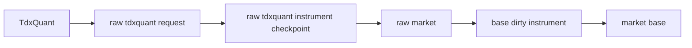

# TdxQuant 日更原始事实接入 raw/base 账本桥接

卡片编号：`19`
日期：`2026-04-10`
状态：`草稿`

## 需求

- 问题：
  卡 `18` 已经把第二阶段日更方向收敛到一条更清晰的路线：
  - `.day` 本地直读不适合作为唯一每日主路径
  - `TdxQuant` 更接近官方日更源头
  - 但 `TdxQuant(front/back)` 当前不能直接进入正式复权账本

  因此卡 `19` 不再研究“如何继续每天导三份 `txt`”，而是研究并实现：

  `如何把 TdxQuant 的日更原始事实正式接进现有 raw/base 账本机制`

- 目标结果：
  开出并推进一张实现卡，冻结并落地：
  - `TdxQuant -> raw_market` 的正式 runner 与 CLI 入口
  - TQ 路线的 `run / request / instrument checkpoint` 审计语义
  - 与现有 `base_dirty_instrument`、`run_market_base_build(...)` 的联动边界
  - 与现有 `txt` 正式入口并存时的 fallback 规则

- 为什么现在做：
  卡 `18` 已经把源头选型中的主要不确定性压缩到“官方 raw 日更能不能正式接进账本”和“复权是否继续留在仓内物化层”。
  下一步最合理的推进，不是重复证明 `txt` 方案能跑，而是开始建立官方日更原始事实桥接层，为后续“官方日更 + 仓内可审计复权物化”做正式落地准备。

## 设计输入

- 设计文档：
  - `docs/01-design/modules/data/01-tdx-offline-raw-and-market-base-bridge-charter-20260410.md`
  - `docs/01-design/modules/data/02-raw-base-strong-checkpoint-and-dirty-materialization-charter-20260410.md`
  - `docs/01-design/modules/data/03-daily-raw-base-fq-incremental-update-source-selection-charter-20260410.md`
  - `docs/01-design/modules/data/04-tdxquant-daily-raw-source-ledger-bridge-charter-20260410.md`
- 规格文档：
  - `docs/02-spec/modules/data/01-tdx-offline-raw-and-market-base-bridge-spec-20260410.md`
  - `docs/02-spec/modules/data/02-raw-base-strong-checkpoint-and-dirty-materialization-spec-20260410.md`
  - `docs/02-spec/modules/data/03-daily-raw-base-fq-incremental-update-source-selection-spec-20260410.md`
  - `docs/02-spec/modules/data/04-tdxquant-daily-raw-source-ledger-bridge-spec-20260410.md`
- 当前锚点结论：
  - `docs/03-execution/17-raw-base-strong-checkpoint-and-dirty-materialization-conclusion-20260410.md`
  - `docs/03-execution/18-daily-raw-base-fq-incremental-update-source-selection-conclusion-20260410.md`

## 任务分解

1. 建立卡 `19` 的正式设计与实现边界。
   - 冻结 `TdxQuant` 在本卡只作为”日更原始事实源头”
   - 冻结 `front/back` 不直接进入正式 `market_base`
   - 冻结与 `txt` 正式入口并存的 fallback 规则
2. 设计 raw 侧账本桥接合同。
   - 明确 `run_tdxquant_daily_raw_sync(...)` 与 CLI 入口
   - 明确 `raw_tdxquant_run / raw_tdxquant_request / raw_tdxquant_instrument_checkpoint`
   - 明确与 `stock_daily_bar(adjust_method='none')`、`base_dirty_instrument` 的对接
3. 推进 bounded 实现与最小 official pilot。
   - 落最小 runner
   - 做至少一轮 official bounded run
   - 回填 evidence / record / conclusion

## TdxQuant 桥接图

## 实现边界

- 范围内：
  - `docs/01-design/modules/data/04-*`
  - `docs/02-spec/modules/data/04-*`
  - `docs/03-execution/19-*`
  - `src/mlq/data/*` 中与 TQ raw 侧桥接直接相关的最小实现
  - `scripts/data/run_tdxquant_daily_raw_sync.py`
- 范围外：
  - 直接废弃卡 `17` 的 `txt` 正式入口
  - 直接让 `TdxQuant(front/back)` 进入正式 `market_base`
  - corporate action 总账
  - 下游 `malf / structure / filter / alpha` 改造

## 收口标准

1. `design/spec/card` 已写成正式口径并通过治理校验
2. `run_tdxquant_daily_raw_sync(...)` 的最小正式实现落地
3. 至少一轮 bounded official pilot 已形成真实证据
4. `record` 写完
5. `conclusion` 写完，并明确：
   - 是否接受 TQ raw 日更桥接进入正式主链
   - 与 `txt` 路线如何并存
   - 下一张卡是否需要继续处理复权物化问题
