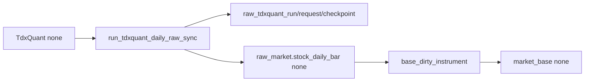

# TdxQuant 日更原始事实接入 raw/base 账本桥接 结论

结论编号：`19`
日期：`2026-04-10`
状态：`生效`

## 裁决

- 接受：卡 `19` 的实现方向聚焦于“把 TdxQuant 日更原始事实正式接进 raw_market 账本”。
- 接受：卡 `19` 当前只应把官方 `none` 路线视作原始事实桥接对象。
- 接受：卡 `19` 已完成最小 official pilot，可把 `run_tdxquant_daily_raw_sync(...)` 视为 `data` 模块新的正式 bounded runner 入口之一。
- 拒绝：在卡 `19` 里直接把 `TdxQuant(front/back)` 当作正式 `raw_forward / raw_backward` 或正式 `market_base`。

## 原因

- 卡 `18` 已经证明，`TdxQuant` 更接近日更主源头，但其 `front/back` 当前不具备稳定、可复算的正式复权语义。
- 当前最需要推进的不是继续手工 `txt` 导入，而是把官方日更事实纳入现有 `raw/base` 的 run ledger、checkpoint、dirty queue 与 fallback 机制。
- 本轮真实 bounded pilot 已证明：
  - `run_tdxquant_daily_raw_sync(...)` 能在本机真实 `TdxW.exe` 环境下成功桥接 `000001.SZ / 920021.BJ / 510300.SH`
  - 首轮 official run 已形成真实 `inserted / rematerialized / dirty_mark`
  - 第二轮 official replay 已形成真实 `skipped_unchanged / checkpoint` 审计
- 本轮也同时暴露并修复了一个联动边界问题：
  - 旧版 `run_market_base_build(...)` 在 `dirty_queue` 下仍会被全局 `limit=1000` 截断
  - 这会让脏标的完整历史窗口被裁掉，破坏 `raw -> base` 的正式联动
  - 现已修复为 `dirty_queue` stage 不再受全局 row limit 截断，并由单测覆盖

## 影响

- 卡 `19` 已完成，`data` 侧当前正式口径已新增 `TdxQuant(none) -> raw_market` 桥接入口。
- 当前卡 `17` 的 `txt -> raw_market -> market_base` 入口继续保持生效。
- 卡 `19` 的切片 2 已补齐最小代码骨架：
  - `raw_tdxquant_run / request / checkpoint` 三表已进入正式 bootstrap
  - `run_tdxquant_daily_raw_sync(...)` 已可桥接 `dividend_type='none'`
  - `request/checkpoint` skipped_unchanged 与 failed run 审计已有单测覆盖
  - 真实 official pilot 已写入正式 `raw_market`，并完成一次真实 `base_dirty_instrument -> run_market_base_build(adjust_method='none')` 联动
- 当前主线卡已清零；后续最可能的新问题将转向：
  - TQ raw 日更与 `txt` fallback 的并存治理
  - 仓内复权物化如何接管 `forward / backward`

## TdxQuant 桥接链路图

