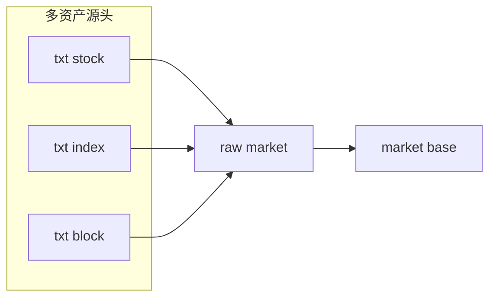

# 指数与板块 raw-base 增量桥接
卡片编号：`20`
日期：`2026-04-10`
状态：`草稿`

## 需求

- 问题：
  卡 `19` 完成后，个股已经具备正式 `txt / TdxQuant -> raw_market -> market_base` 链路，但 `H:\tdx_offline_Data\index` 与 `H:\tdx_offline_Data\block` 仍未进入正式历史账本，后续任何指数对照或板块背景都还会回退到目录直读。
- 目标结果：
  冻结 `index/block` 的 design/spec/card，落地 `txt(index/block) -> raw_market -> market_base` 的正式 runner，把共享 raw/base 审计账本升级为多 `asset_type`，并形成至少一轮 bounded 初始化与一轮增量 replay 证据。
- 为什么现在做：
  个股的 raw/base 增量账本已经验证成立，当前最合理的下一步不是再开新来源，而是把同形态的指数与板块 txt 数据纳入同等治理强度的正式链路。

## 设计输入

- 设计文档：
  - `docs/01-design/modules/data/01-tdx-offline-raw-and-market-base-bridge-charter-20260410.md`
  - `docs/01-design/modules/data/02-raw-base-strong-checkpoint-and-dirty-materialization-charter-20260410.md`
  - `docs/01-design/modules/data/03-daily-raw-base-fq-incremental-update-source-selection-charter-20260410.md`
  - `docs/01-design/modules/data/04-tdxquant-daily-raw-source-ledger-bridge-charter-20260410.md`
  - `docs/01-design/modules/data/05-index-block-raw-base-incremental-bridge-charter-20260410.md`
- 规格文档：
  - `docs/02-spec/modules/data/01-tdx-offline-raw-and-market-base-bridge-spec-20260410.md`
  - `docs/02-spec/modules/data/02-raw-base-strong-checkpoint-and-dirty-materialization-spec-20260410.md`
  - `docs/02-spec/modules/data/03-daily-raw-base-fq-incremental-update-source-selection-spec-20260410.md`
  - `docs/02-spec/modules/data/04-tdxquant-daily-raw-source-ledger-bridge-spec-20260410.md`
  - `docs/02-spec/modules/data/05-index-block-raw-base-incremental-bridge-spec-20260410.md`
- 当前锚点结论：
  - `docs/03-execution/19-tdxquant-daily-raw-source-ledger-bridge-conclusion-20260410.md`

## 任务分解

1. 开卡 `20`，补齐 `index/block` 的 design/spec/card，并把执行索引切到当前施工卡。
2. 升级 raw/base 共享账本为多 `asset_type`，落 `index/block` raw ingest 与 base build 的最小正式实现，同时保留 stock 兼容入口。
3. 补单测，完成 bounded 初始化与增量 replay，并回填 evidence / record / conclusion。

## 多 asset_type 账本图

## 实现边界

- 范围内：
  - `docs/01-design/modules/data/05-*`
  - `docs/02-spec/modules/data/05-*`
  - `docs/03-execution/20-*`
  - `src/mlq/data/*` 与 `scripts/data/*` 中直接相关的最小实现
  - `tests/unit/data/test_data_runner.py`
- 范围外：
  - `index/block` 的 TdxQuant official raw 桥接
  - 板块成分关系账本
  - 下游 `malf / structure / filter / alpha` 的指数/板块消费改造

## 收口标准

1. `design/spec/card` 已具备正式口径并通过治理检查。
2. `index/block` raw ingest 已可一次性建仓并支持每日断点增量。
3. `index/block` base build 已可通过 dirty queue 做增量物化。
4. evidence / record / conclusion 与执行索引回填完成。
