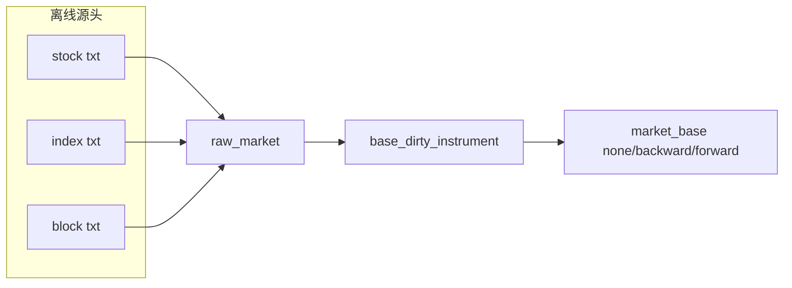

# 指数与板块 raw/base 增量桥接结论

结论编号：`20`
日期：`2026-04-10`
状态：`生效`

## 裁决

- 接受：卡 `20` 已正式把 `H:\tdx_offline_Data\index` 与 `H:\tdx_offline_Data\block` 接入 `raw_market / market_base` 历史账本。
- 接受：正式链路采用与个股一致的两步走契约，即“一次性批量建仓 + 每日断点续传增量更新”。
- 接受：`raw/base` 共享审计账本已升级为显式 `asset_type` 语义，指数与板块不再借道股票表族。
- 接受：正式 bounded runner 入口新增 `scripts/data/run_tdx_asset_raw_ingest.py`，`scripts/data/run_market_base_build.py` 正式支持 `--asset-type {stock,index,block}`。
- 拒绝：在本卡顺手引入 `index/block` 的 TdxQuant official 桥接、板块成分关系账本或其他 sidecar 能力。

## 当前正式口径

- `raw_market` 正式表族新增：
  - `index_file_registry / index_daily_bar`
  - `block_file_registry / block_daily_bar`
- `market_base` 正式表族新增：
  - `index_daily_adjusted`
  - `block_daily_adjusted`
- 共享审计账本新增显式 `asset_type`：
  - `raw_ingest_run / raw_ingest_file`
  - `base_dirty_instrument`
  - `base_build_run / base_build_scope / base_build_action`
- `run_tdx_asset_raw_ingest(...)` 正式负责 `stock/index/block` 的 txt 源增量写入 `raw_market`，并按 `asset_type + code + adjust_method` 挂 `base_dirty_instrument`。
- `run_asset_market_base_build(...)` 正式负责按 `asset_type` 从 `raw_market` 物化 `market_base`，支持 full build、dirty queue 增量消费、断点续跑与 no-op replay。

## 已验证事实

- 实盘全量建仓完成：
  - `index`
    - `backward / none / forward` 各 `100` 文件，`377711` 行/套
  - `block`
    - `backward / none / forward` 各 `127` 文件，`468542` 行/套
- 实盘 full base 物化完成：
  - `index_daily_adjusted`
    - `backward / none / forward` 各 `377711` 行
  - `block_daily_adjusted`
    - `backward / none / forward` 各 `468542` 行
- 实盘 incremental replay 完成：
  - raw replay 全量命中 `skipped_unchanged`
    - `index` 三套各 `100`
    - `block` 三套各 `127`
  - base replay 在空 dirty queue 下 no-op 成功
    - 六组 `source_row_count = 0`
    - 六组 `consumed_dirty_count = 0`
- 当前 `index/block` dirty queue 状态已全部消费完成，不存在 pending 积压。

## 影响

- 当前最新正式生效锚点切换为卡 `20`。
- `data` 模块的 txt 正式主链已从“仅个股”扩展为：
  - `stock txt -> raw_market -> market_base`
  - `index txt -> raw_market -> market_base`
  - `block txt -> raw_market -> market_base`
- `txt -> raw_market -> market_base` 仍保留为正式 fallback；卡 `19` 的 `TdxQuant(none)` 股票日更桥接继续成立，且与本卡不冲突。

## 全资产 raw/base 覆盖图

