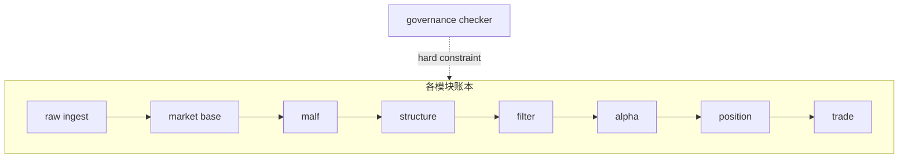

# 全系统历史账本增量治理硬约束

卡片编号：`21`
日期：`2026-04-10`
状态：`完成`

## 需求

- 问题：卡 `17/19/20` 已经在 `raw/base` 证明“批量建仓 + 日更增量 + 断点续跑 + 稳定自然键 + 审计账本”可行，但这套机制仍未被提升为全系统硬约束，后续模块仍可能各写各的。
- 目标结果：把这套机制冻结为全系统共享合同，并接入正式 gating/checker，要求后续所有正式卡与正式实现都必须显式声明自然键、checkpoint、增量策略与审计账本。
- 为什么现在做：`data` 主链已经覆盖 `stock + index + block + TdxQuant(none)`，继续推进下游模块前，必须先把这套历史账本治理口径写死，不然重构会在后续模块再次漂移。

## 设计输入

- 设计文档：`docs/01-design/modules/system/01-system-ledger-incremental-governance-hardening-charter-20260410.md`
- 规格文档：`docs/02-spec/modules/system/01-system-ledger-incremental-governance-hardening-spec-20260410.md`

## 任务分解

1. 切片 1：重写共享历史账本合同，明确稳定实体锚点、业务自然键、批量建仓、增量更新、断点续跑与审计账本的全系统正式口径。
2. 切片 2：升级执行卡模板与 `check_doc_first_gating_governance.py`，把 `历史账本约束` 六条声明接入正式硬门禁。
3. 切片 3：补单测、同步入口文件与执行闭环，并确认卡 `20` 的 `index/block raw->base` 已作为新合同的已验证前置事实。

## 全系统治理结构图

## 实现边界

- 范围内：
  - 共享合同文档
  - 执行卡模板
  - `doc-first gating` 检查器
  - 相关单测
  - 入口文件与执行索引
- 范围外：
  - 重写既有所有模块的 schema
  - 新增下游业务账本实现
  - 重做卡 `20` 已完成的 `index/block raw->base` 初始化

## 历史账本约束

- 实体锚点：全系统正式主锚先使用稳定实体锚点，标的默认是 `asset_type + code`；`name` 只作属性、快照或审计辅助字段。
- 业务自然键：实体锚点之上必须再叠加时间键、窗口键、家族键、场景键或状态键，严禁只靠 `run_id` 充当长期主语义。
- 批量建仓：每个正式账本都必须声明首次 full bootstrap / historical backfill 如何执行，不能只定义增量逻辑。
- 增量更新：每个正式账本都必须声明后续 daily/batch incremental 策略，说明怎样判定新增、复用、重物化或 no-op replay。
- 断点续跑：每个正式实现都必须声明 checkpoint / cursor / dirty queue / 等价续跑锚点写在哪里，以及中断后如何续跑。
- 审计账本：每个正式实现都必须保留 `run_id`、时间戳、source 信息、status/action/summary 之一或等价审计语义，并与业务自然键分层。

## 收口标准

1. 新的共享合同文档已生效并写明全系统硬约束。
2. 当前卡模板已内置 `历史账本约束` 段。
3. `check_doc_first_gating_governance.py` 已把该段纳入强校验。
4. 对应单测通过。
5. 卡 `21` 的 evidence / record / conclusion 与执行索引已回填完毕。
