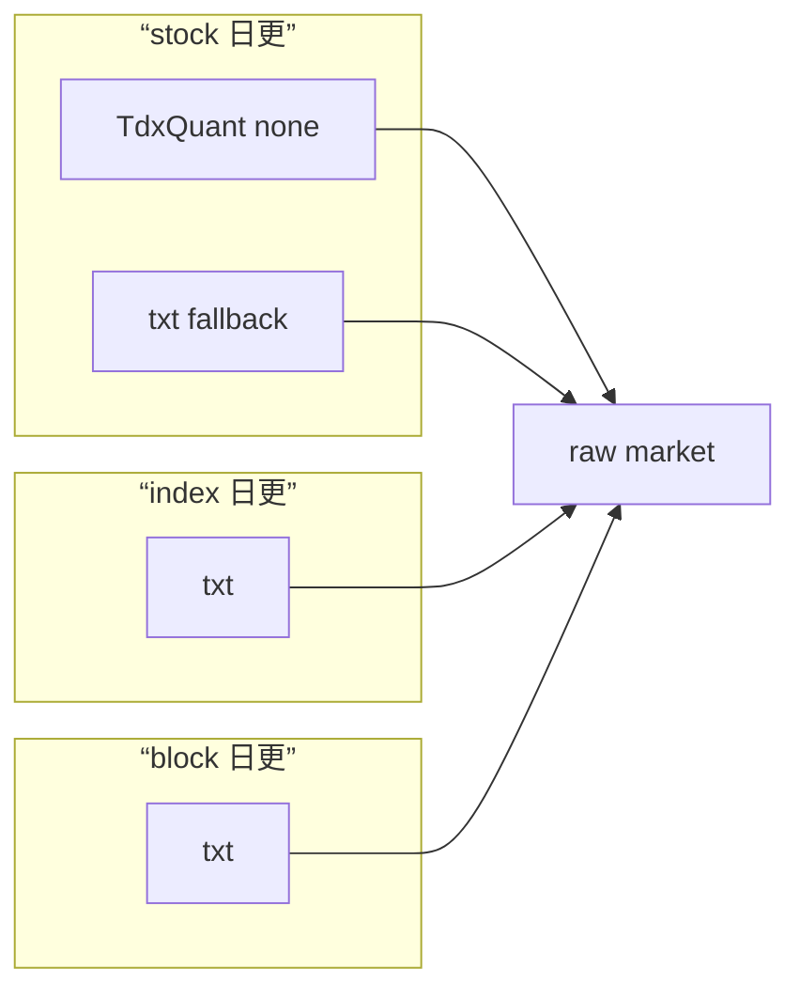

# data 日更源头治理封存
卡片编号：`22`
日期：`2026-04-11`
状态：`完成`

## 需求

- 问题：
  卡 `18/19/20/21` 已经把 `data` 模块的日更主链、fallback 与历史账本硬约束冻结为正式口径，但在实际执行 `2026-04-10` 收盘后增量更新、并讨论“是否统一 source adapter”之后，仍需要一张封存卡把当前已生效事实、operator 责任边界与未来扩展门槛写死，避免后续再把“统一主源”当成已批准事项。
- 目标结果：
  正式封存 `data` 模块当前日更源头治理口径：`stock` 继续以 `TdxQuant(none)` 为日更主路、`txt` 为 fallback；`index/block` 继续以 `H:\tdx_offline_Data` txt 为日更主路；不在当前阶段推进 source adapter 统一；若后续要统一为 “`TdxQuant(none)` 主路 + txt fallback”，必须重新开卡并补齐 bounded 验证与治理合同。
- 为什么现在做：
  `2026-04-10` 收盘后真实联动更新已经验证，用户也明确承诺会每日维护 `H:\tdx_offline_Data`。当前最需要的是把这套运营现实和未来扩展边界固化为正式结论，而不是继续开启新的实现分支。

## 设计输入

- 设计文档：
  - `docs/01-design/modules/data/03-daily-raw-base-fq-incremental-update-source-selection-charter-20260410.md`
  - `docs/01-design/modules/data/04-tdxquant-daily-raw-source-ledger-bridge-charter-20260410.md`
  - `docs/01-design/modules/data/05-index-block-raw-base-incremental-bridge-charter-20260410.md`
  - `docs/01-design/modules/system/01-system-ledger-incremental-governance-hardening-charter-20260410.md`
- 规格文档：
  - `docs/02-spec/modules/data/03-daily-raw-base-fq-incremental-update-source-selection-spec-20260410.md`
  - `docs/02-spec/modules/data/04-tdxquant-daily-raw-source-ledger-bridge-spec-20260410.md`
  - `docs/02-spec/modules/data/05-index-block-raw-base-incremental-bridge-spec-20260410.md`
  - `docs/02-spec/modules/system/01-system-ledger-incremental-governance-hardening-spec-20260410.md`
- 当前锚点结论：
  - `docs/03-execution/18-daily-raw-base-fq-incremental-update-source-selection-conclusion-20260410.md`
  - `docs/03-execution/19-tdxquant-daily-raw-source-ledger-bridge-conclusion-20260410.md`
  - `docs/03-execution/20-index-block-raw-base-incremental-bridge-conclusion-20260410.md`
  - `docs/03-execution/21-system-ledger-incremental-governance-hardening-conclusion-20260410.md`

## 任务分解

1. 汇总卡 `18/19/20/21` 与 `2026-04-10` 收盘后真实增量运行得到的 source governance 观察，整理成当前已生效事实。
2. 冻结 `stock / index / block` 三类资产当前日更主路、fallback、operator 责任边界与”暂不统一”的治理裁决。
3. 明确未来若要推进 “`TdxQuant(none)` 主路 + txt fallback” 的统一方案，必须补开的设计、验证与治理门槛，并把四件套和执行索引回填完成。

## 源头治理封存图

## 实现边界

- 范围内：
  - `docs/03-execution/22-*`
  - `docs/03-execution/evidence/22-*`
  - `docs/03-execution/records/22-*`
  - `docs/03-execution/00-conclusion-catalog-20260409.md`
  - `docs/03-execution/A-execution-reading-order-20260409.md`
  - `docs/03-execution/B-card-catalog-20260409.md`
  - `docs/03-execution/C-system-completion-ledger-20260409.md`
  - `docs/03-execution/evidence/00-evidence-catalog-20260409.md`
- 范围外：
  - 改写 `src/mlq/data` 的现有 source adapter
  - 新增 `index/block` 的 TdxQuant 正式 runner
  - 推进 source adapter 统一实现
  - 改写 `raw_market / market_base` schema

## 历史账本约束

- 实体锚点：
  本卡治理对象继续以正式标的锚点 `asset_type + code` 为主语义，不接受用 `name` 替代标的主锚。
- 业务自然键：
  当前 data 主链继续坚持 `raw` 侧原始事实键与 `base` 侧 `asset_type + code + trade_date + adjust_method` 系列自然键；source adapter 的切换不改变账本自然键口径。
- 批量建仓：
  当前一次性建库事实已冻结为 `txt(stock/index/block) -> raw_market -> market_base` 的 full bootstrap 口径；本卡不重做建仓，只封存其作为当前正式已验证基础。
- 增量更新：
  当前增量更新冻结为 `stock: TdxQuant(none) 主路 + txt fallback`，`index/block: txt 主路`；未来若改为统一主路，必须重新声明增量策略和 fallback 切换合同。
- 断点续跑：
  当前继续沿用 `raw_ingest_run / raw_ingest_file`、`raw_tdxquant_run / request / checkpoint`、`base_dirty_instrument / base_build_run` 的续跑语义；本卡不引入新的 checkpoint 模型。
- 审计账本：
  当前继续以 `raw_ingest_run / raw_ingest_file / raw_tdxquant_run / raw_tdxquant_request / raw_tdxquant_instrument_checkpoint / base_dirty_instrument / base_build_run / base_build_scope / base_build_action` 作为正式审计账本。

## 收口标准

1. `22` 号 card/evidence/record/conclusion 四件套写完，并明确 data 日更源头治理封存口径。
2. 执行索引、结论目录、阅读顺序、完成台账与 evidence 目录完成回填。
3. 当前正式口径明确写明“不再把 source adapter 统一视为已批准工作”。
4. 未来若要统一 source adapter 的扩展门槛已在结论中明示。
