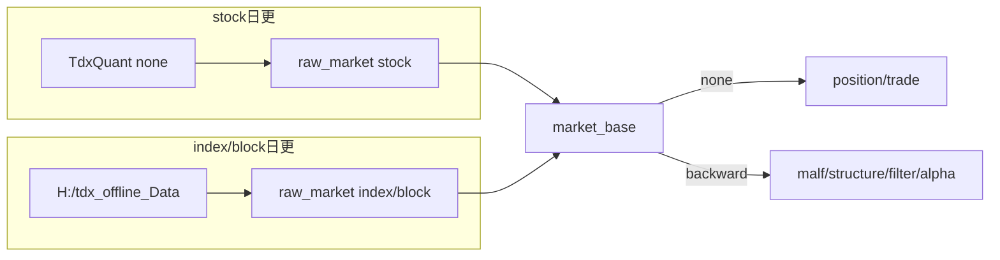

# data 日更源头治理封存 结论

结论编号：`22`
日期：`2026-04-11`
状态：`生效`

## 裁决

- 接受：当前 `data` 模块日更 source governance 已达到可执行封存状态，不再把“统一 source adapter”视为当前主线待办。
- 接受：`stock` 的当前正式日更主路继续冻结为 `TdxQuant(dividend_type='none') -> raw_market.stock_daily_bar(adjust_method='none') -> base_dirty_instrument -> market_base.stock_daily_adjusted(adjust_method='none')`。
- 接受：`stock` 的 `txt -> raw_market -> market_base` 正式入口继续保留为 fallback、审计回放与 full bootstrap 口径，不因 `TdxQuant(none)` 桥接生效而失效。
- 接受：`index/block` 的当前正式日更主路继续冻结为 `H:\tdx_offline_Data\{index,block}\* -> raw_market -> base_dirty_instrument -> market_base`，并把用户/operator 每日维护 `H:\tdx_offline_Data` 视为当前正式运行前提。
- 接受：当前继续坚持“只把 `none` 视作 official raw 真值、把 `forward/backward` 留在仓内 `market_base` 物化层”的复权治理口径。
- 接受：未来如果要推进 “`stock/index/block` 全部切到 `TdxQuant(none)` 主路、txt 只做 fallback” 的统一方案，必须重新开卡，补齐 `index/block` 的 official adapter 契约、bounded evidence、fallback 合同与 replay 审计证明。
- 拒绝：把当前关于 source adapter 统一的讨论，直接视为已获批准的正式实现方向。
- 拒绝：在没有新卡和新证据的情况下，把 `TdxQuant(front/back)` 直接视为正式 `raw_forward / raw_backward` 或正式 `market_base` 真值面。

## 原因

- 卡 `18` 的正式结论已经冻结：候选 B 更适合作为日更主源头，但前提是“复权留在仓内可审计物化层”，且当前不接受把 `TdxQuant(front/back)` 直接等同于正式复权真值。
- 卡 `19` 的正式实现只把 `TdxQuant(none)` 正式接进了 `stock` 的 raw/source ledger，并未把 `index/block` 的 official 日更桥接合同写成正式入口。
- 卡 `20` 已经把 `index/block txt -> raw_market -> market_base` 的 full bootstrap、incremental replay 与 dirty queue 消费证明为可运行正式主链；在用户已明确会每日维护 `H:\tdx_offline_Data` 的前提下，当前没有必要为了“统一”而重写已验证主路。
- 卡 `21` 已将“自然键优先、先建仓后增量、必须断点续跑、必须有审计账本”的历史账本硬约束升级为全系统门禁；source adapter 的变更不应绕开新门禁直接进入实现。
- `2026-04-10` 收盘后真实运行进一步证明：当前双 adapter 状态下，下游账本机制仍然是统一的。`stock` 的 `TdxQuant(none)` replay 正常，`index/block` 的 txt 增量与 `base` dirty queue 联动也正常，因此当前问题不是账本机制割裂，而只是 source adapter 仍处于阶段性分工。

## 影响

- 最新正式生效结论锚点切换为卡 `22`，当前 `data` 模块源头治理以本卡为封存结论。
- 当前 operator 运行口径冻结为：
  - `stock`：优先跑 `TdxQuant(none)` 日更；必要时回退到 txt 正式入口。
  - `index/block`：每日更新 `H:\tdx_offline_Data`，再通过 txt 正式入口完成 raw/base 联动。
- 后续任何“统一 source adapter”“把 `index/block` 也切到 TdxQuant 主路”“让 `TdxQuant(front/back)` 直接进正式真值面”的方案，必须先补新的 design/spec/card/evidence/record/conclusion，不得把本卡解读成默许实现。
- `data` 模块的未来扩展方向已被限制为：
  - 可以研究 `index/block` 的 official 日更桥接；
  - 可以研究 “`TdxQuant(none)` 主路 + txt fallback” 的全资产统一治理；
  - 但必须以不破坏当前正式 txt fallback 与仓内复权物化口径为前提。

## data 双路径运行图

