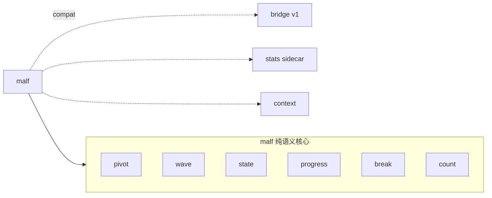

# malf 纯语义账本边界冻结

卡片编号：`23`
日期：`2026-04-11`
状态：`完成`

## 需求

- 问题：
  当前 `malf` 的最新扩展设计把 `execution interface`、高周期 `context` 与本级别结构账本重新混在一起，导致 `malf` 的正式身份从“走势记账系统”漂回“解释 + 动作混合层”，与用户最新冻结的纯语义理解冲突。
- 目标结果：
  把 `malf` 的正式核心收缩为按时间级别独立运行的纯语义走势账本，只保留 `HH / HL / LL / LH / break / count` 与本级别 `pivot / wave / state / progress` 语义；把 `execution_interface`、高周期 `context`、动作建议与策略解释正式移出 `malf` 核心；明确 `牛逆 / 熊逆` 是本级别过渡状态而不是背景标签；保留当前 bridge v1 runner 作为兼容层。
- 为什么现在做：
  这一步不先收口，后续 `structure / filter / alpha` 会继续围绕错误的 `malf` 身份扩展，造成跨级别反馈、模块边界回潮与文档入口失真。

## 设计输入

- 设计文档：
  - `docs/01-design/modules/malf/00-malf-module-lessons-20260409.md`
  - `docs/01-design/modules/malf/01-market-base-to-malf-minimal-snapshot-bridge-charter-20260410.md`
  - `docs/01-design/modules/malf/03-malf-pure-semantic-structure-ledger-charter-20260411.md`
  - `docs/01-design/modules/structure/01-structure-formal-snapshot-charter-20260409.md`
  - `docs/01-design/modules/filter/01-filter-formal-snapshot-charter-20260409.md`
- 规格文档：
  - `docs/02-spec/modules/malf/01-market-base-to-malf-minimal-snapshot-bridge-spec-20260410.md`
  - `docs/02-spec/modules/malf/03-malf-pure-semantic-structure-ledger-spec-20260411.md`
- 当前锚点结论：
  - `docs/03-execution/16-data-malf-minimal-official-mainline-bridge-conclusion-20260410.md`
  - `docs/03-execution/22-data-daily-source-governance-sealing-conclusion-20260411.md`

## 任务分解

1. 收缩 `malf` 正式设计与规格，把纯语义核心、bridge v1 兼容层和下游模块边界重新冻结。
2. 降级 `02` 号 malf 扩展章为历史保留，并新增 `03` 号 design/spec 作为最新正式口径。
3. 把前 4 段合并后的最终公理层写进 `03` 号 malf design/spec 与 `23` 号结论，并明确下一步只剩 `pivot-confirmed break` 与 `same-timeframe stats sidecar` 两个机制层议题。
4. 回填 `23` 号四件套、目录索引和入口文件，确保仓库入口不滞后于最新 `malf` 正式口径。

## malf 核心边界图

## 实现边界

- 范围内：
  - `docs/01-design/modules/malf/*`
  - `docs/02-spec/modules/malf/*`
  - `docs/03-execution/23-*`
  - `docs/03-execution/evidence/23-*`
  - `docs/03-execution/records/23-*`
  - `docs/03-execution/00-conclusion-catalog-20260409.md`
  - `docs/03-execution/A-execution-reading-order-20260409.md`
  - `docs/03-execution/B-card-catalog-20260409.md`
  - `docs/03-execution/C-system-completion-ledger-20260409.md`
  - `docs/03-execution/evidence/00-evidence-catalog-20260409.md`
  - `AGENTS.md`
  - `README.md`
  - `pyproject.toml`
- 范围外：
  - 改写 `src/mlq/malf` 现有实现
  - 改写 `scripts/malf/run_malf_snapshot_build.py`
  - 新增 canonical pure semantic runner
  - 改写 `structure / filter / alpha` 代码消费路径

## 历史账本约束

- 实体锚点：
  `malf` 纯语义核心继续以 `instrument + timeframe` 作为结构账本主锚，不接受用 `name` 或高周期背景替代正式结构主语义。
- 业务自然键：
  文档冻结的 canonical 语义对象继续使用 `instrument + timeframe + bar/pivot/wave/asof` 系列自然键，不允许把 `run_id`、`plan_id` 或动作枚举写回 `malf` 业务主键。
- 批量建仓：
  本卡不新增建仓实现，只冻结“未来 pure semantic canonical ledger 如何一次性从官方 `market_base(backward)` 建立”的合同边界。
- 增量更新：
  本卡不改现有增量 runner，只冻结“未来 pure semantic ledger 必须支持按 `instrument + timeframe` 增量续算，且不得跨级别互相喂状态”的规则。
- 断点续跑：
  本卡不新增 checkpoint 表，只冻结“纯语义 ledger 的 count / wave / state 续算必须绑定本级别波段，不得跨波段回灌”的正式约束。
- 审计账本：
  当前继续沿用现有 `malf_run / run_snapshot` 系列桥接审计账本；未来 pure semantic canonical runner 若落地，必须另开卡补齐自己的 run/audit 合同。

## 收口标准

1. `03` 号 malf design/spec 已成为最新正式口径。
2. `02` 号 malf 扩展 design/spec 已明确降级为历史保留。
3. 前 4 段合并后的最终 `malf` 公理层已正式写入 design/spec。
4. `23` 号 card/evidence/record/conclusion 四件套写完。
5. 执行目录、证据目录与入口文件已同步到 `23` 号锚点。
6. 治理检查通过，且未误宣称 pure semantic canonical code 已落地。
