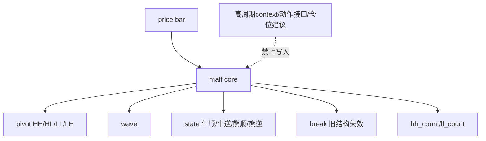

# malf 纯语义账本边界冻结结论

结论编号：`23`
日期：`2026-04-11`
状态：`生效中`

## 裁决

- 接受：
  `malf` 的正式核心收缩为按时间级别独立运行的纯语义走势账本；唯一原语冻结为 `HH / HL / LL / LH / break / count`；正式核心只回答当前结构、当前推进与旧结构是否已被破坏。
- 接受：
  高周期 `context`、`execution_interface`、`allowed_actions`、`confidence`、仓位建议与直接交易解释全部移出 `malf` 核心；若后续需要同级别统计 sidecar，必须单独冻结，且不得反向参与状态机。
- 接受：
  `牛逆 / 熊逆` 的正式定义进一步收紧为：旧顺结构失效后、到新顺结构确认前的本级别过渡状态，不再允许被理解成背景标签或高周期语义。
- 接受：
  当前 `scripts/malf/run_malf_snapshot_build.py` 继续保留 `pas_context_snapshot / structure_candidate_snapshot` 的 bridge v1 兼容职责，但它们不再代表 `malf` 的终局定义。
- 拒绝：
  继续把“月给周背景、周给日背景”写进 `malf` 状态定义。
- 拒绝：
  继续把 `break` 直接写成“新趋势已经成立”。
- 拒绝：
  继续把执行动作接口当作 `malf` 的正式身份。

## 原因

- `malf` 必须先对本级别 `price bar` 自洽闭环，否则结构系统会被解释层与策略层反馈污染。
- 将背景、统计、动作从纯语义结构中剥离，才能保证 `structure / filter / alpha` 的边界长期稳定，并避免跨级别互相解释形成伪闭环。
- 前 4 段裁判结果已经收敛到同一条主线：公理层已足够稳定，剩余争议点已从“是什么”下降到“怎样确认 break / 怎样冻结同级别统计”。

## 影响

- 后续 `structure` 应以 `pivot / wave / state` 纯语义事实为长期正式上游；`filter / alpha` 若要读统计或多级别共读，应在 `malf` 之外建立 sidecar 或消费视图。
- 与 `malf` 相邻的 `structure / filter` design/spec 已同步修订为：bridge v1 兼容上下文只代表过渡输入或下游 sidecar，不再允许被表述成 `malf core`。
- 仓库当前正式口径已切到 `23` 号结论，`AGENTS.md / README.md / pyproject.toml` 与执行目录已同步更新；未来若要落地 pure semantic canonical runner，必须另开新卡。
- `malf` 下一阶段的正式议题只剩两项：`pivot-confirmed break` 是否进入 core 硬规则，以及 `same-timeframe stats sidecar` 如何独立冻结。

## malf 纯语义边界图

