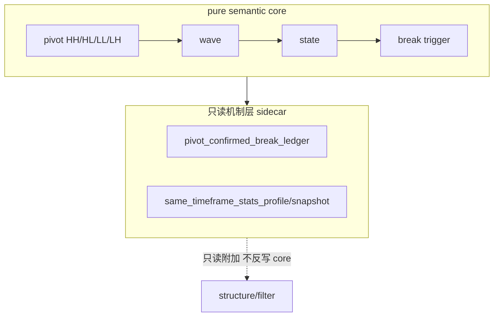

# malf 机制层 break 确认与同级别统计 sidecar 冻结结论

结论编号：`24`
日期：`2026-04-11`
状态：`生效中`

## 裁决

- 接受：
  `pivot-confirmed break` 不进入 `malf core` 原语层；`malf core` 仍只保留 `HH / HL / LL / LH / break / count`。
- 接受：
  break 的正式读取顺序冻结为三段：`break trigger -> pivot-confirmed break -> new progression confirmation`；其中 `pivot-confirmed break` 只提高 break 的结构可信度，不宣布新顺状态成立。
- 接受：
  快行情下若新的 `HH / LL` 直接出现，允许 `pivot-confirmed break` 缺席或被“新推进直接超越”，不得为了补造它而改写 `malf core`。
- 接受：
  `same-timeframe stats sidecar` 的正式身份冻结为只读 sidecar，并拆成 `same_timeframe_stats_profile + same_timeframe_stats_snapshot` 两层；统计只回答同级别位置和分位，不反向参与 `state / wave / break / count`。
- 接受：
  `structure` 可只读附加消费 `pivot_confirmed_break_ledger / same_timeframe_stats_snapshot`；`filter` 优先消费 `structure_snapshot` 再读 `same_timeframe_stats_snapshot`，不得绕回 `malf` 内部过程作为长期正式主入口。
- 拒绝：
  把 `pivot-confirmed break` 写成新的 `major_state` 定义或趋势确认前提。
- 拒绝：
  把同级别统计重新写回 `malf core`、跨级别混样本，或借此恢复动作接口。

## 原因

- `23` 号卡已经把 `malf` 的正式身份压回纯语义走势账本；若机制层边界不继续冻结，下游会重新把确认逻辑、统计和上下文偷塞回 `malf core`。
- `pivot-confirmed break` 的真实作用是把 bar 级 break 提升到 pivot 级可确认阶段，它解决的是“break 站没站稳”，不是“新趋势成没成立”。
- 同级别统计若没有独立实体与自然键，就会重新退化成散落在 `structure / filter / alpha` 私有字段里的软解释层，无法保持审计、增量和复算一致性。

## 影响

- `malf` 现在正式分成两层：
  - `03` 号文档定义 pure semantic core
  - `04` 号文档定义只读机制层 sidecar
- `structure / filter` 已同步补充角色声明；其中 `structure` 规格正文的正式输入合同也已吸收“只读机制层可选输入”口径：若消费 `pivot-confirmed break` 或 `same-timeframe stats sidecar`，只能按只读机制层解释，不得反向定义 `malf core`。
- 执行区当前最新生效结论锚点已切到 `24`；治理锚点暂保留 `24` 以满足门禁检查，但这不表示 `24` 仍未完成，正式主线剩余卡已清零。
- 当前结论仍然只冻结正式合同，不宣称 canonical mechanism runner 或新账本表族代码已经落地；若后续要实现这些账本，必须另开新卡。

## malf 两层分离图

