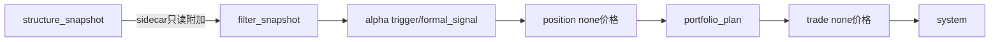

# 主链 truthfulness 复核结论
结论编号：`26`
日期：`2026-04-11`
状态：`生效中`

## 裁决

- 接受：在修正 `scripts/position/run_position_formal_signal_materialization.py` 的 CLI 默认价格口径后，当前主链 `data -> malf -> structure -> filter -> alpha -> position -> portfolio_plan -> trade` 的 truthfulness 复核通过，`23/24/25` 引入的新 `malf` 口径没有破坏整链正式闭环。
- 接受：`break/stats sidecar` 当前仍保持只读附加身份。`structure` 只附加 sidecar 字段，`filter` 只透传与提示，`alpha` 仍只消费官方 `filter / structure snapshot`，没有把 sidecar 升级成新的硬前提。
- 接受：`backward -> none` 价格边界仍与正式治理口径一致。`malf -> structure -> filter -> alpha` 继续站在上游官方快照链上，`position -> trade` 经 bounded 整链验证仍使用 `none` 口径，不存在误回退到 `backward` 的事实。
- 接受：当前不需要另开后置修复卡。26 号卡中发现的唯一真实偏差是 `position` CLI 默认值漂移，该问题已在本卡内修正并补回归测试。
- 裁决：下一张应开 `system` 主线卡，而不是修复卡。

## 原因

- 静态合同复核结果表明，当前正式 runner 仍按冻结链路对接：
  - `structure` 继续从官方 `malf` bridge v1 输出与只读 sidecar 生成 `structure_snapshot`
  - `filter` 继续从官方 `structure_snapshot` 与最小执行上下文生成 `filter_snapshot`
  - `alpha trigger / formal signal` 继续只消费官方 `filter / structure snapshot`
  - `position` 继续只消费官方 `alpha_formal_signal_event` 与 `market_base.stock_daily_adjusted(adjust_method='none')`
  - `portfolio_plan` 继续只消费官方 `position_candidate_audit / position_capacity_snapshot / position_sizing_snapshot`
  - `trade` 继续只消费官方 `portfolio_plan_snapshot`、上一轮 `trade_carry_snapshot` 与 `market_base.stock_daily_adjusted(adjust_method='none')`
- 动态 bounded 验证结果表明，sidecar 新口径没有挤占主链判定权：
  - `structure_snapshot` 在附加 `break_confirmation_status / stats_snapshot_nk / exhaustion_risk_bucket / reversal_probability_bucket` 的同时，`structure_progress_state` 仍保持由结构输入推进
  - `filter_snapshot` 对 `break_confirmation=confirmed` 与 `exhaustion_risk=high` 仅写 note，不把它们变成新的 `primary_blocking_condition`
  - `alpha_trigger_event / alpha_formal_signal_event` 持续保留对官方 `filter_snapshot_nk / structure_snapshot_nk` 的引用链
- 动态 bounded 验证同时证明 `position -> trade` 的 `none` 价格边界真实成立：
  - `position` 选择 `2026-04-09` 的 `none` 收盘价 `10.6`
  - `trade` 在 `2026-04-09` 之后跳过仅存在于 `backward` 口径的 `2026-04-10`，选择 `none` 口径的下一交易日 `2026-04-11`

## 影响

- 当前最新生效结论锚点切换为 `26-mainline-truthfulness-revalidation-after-malf-sidecar-bootstrap-conclusion-20260411.md`。
- `position` 的正式 CLI 入口重新与正式合同对齐，后续通过脚本执行时不再默认误用 `backward` 价格。
- `23/24/25` 之后的主链现已具备进入下一张 `system` 主线卡的资格；后续不应再以“主链尚未 truthfulness 复核”为理由阻塞 `system`。
- `alpha-position sidecar readout` 与 `malf canonical runner bootstrap` 仍不是当前优先项；若后续要做，必须排在 `system` 主线卡之后，或另有新的正式裁决推翻本结论。

## 验证

- `python -m pytest tests/unit/position/test_cli_entrypoint.py tests/unit/system/test_mainline_truthfulness_revalidation.py`
- `python -m pytest tests/unit/alpha/test_runner.py tests/unit/position/test_position_runner.py tests/unit/portfolio_plan/test_runner.py tests/unit/trade/test_trade_runner.py`
- `python .codex/skills/lifespan-execution-discipline/scripts/check_execution_indexes.py --include-untracked`
- `python scripts/system/check_doc_first_gating_governance.py`
- `python scripts/system/check_development_governance.py scripts/position tests/unit/alpha tests/unit/position tests/unit/portfolio_plan tests/unit/trade tests/unit/system docs/03-execution`

## 主链真值复核图

