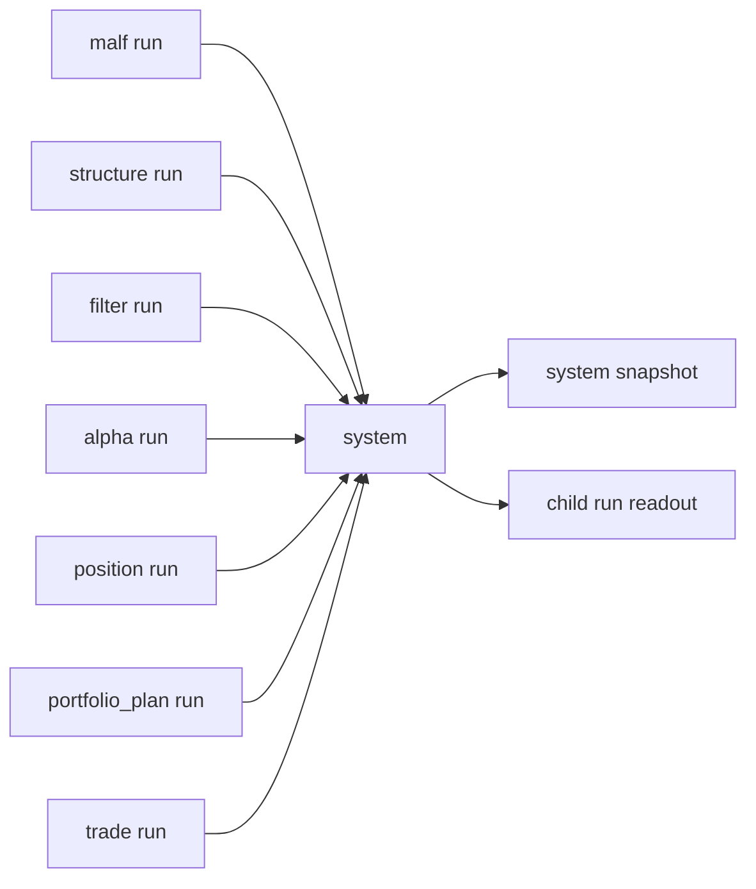

# system 主链 bounded acceptance readout 与 audit bootstrap 卡
卡号：`27`
日期：`2026-04-11`
状态：`待执行`

## 需求

- 问题：
  `26` 已经正式裁决当前主链
  `data -> malf -> structure -> filter -> alpha -> position -> portfolio_plan -> trade`
  仍然真实成立，但仓库还缺少一个官方 `system` 层最小账本，来回答“这次 bounded mainline 是否成立、引用了哪些 child run、当前系统级 snapshot 是什么、哪些结果被 reused 或 rematerialized”。
- 目标结果：
  正式建立 `system` 最小官方 readout / audit / freeze bootstrap，把当前已成立的主链结果上收为可续跑、可复算、可审计的 `system` 账本与 bounded runner。
- 为什么现在做：
  如果此时不进入 `system`，主线将长期停留在“模块级都成立、系统级仍无官方 readout”的状态；后续任何 live orchestration、runtime reuse 或 broker/account lifecycle 扩展都会缺少正式落点。

## 设计输入

- 设计文档：
  - `docs/01-design/modules/system/03-system-mainline-bounded-acceptance-readout-and-audit-bootstrap-charter-20260411.md`
  - `docs/01-design/α-system-roadmap-and-progress-tracker-charter-20260409.md`
- 规格文档：
  - `docs/02-spec/modules/system/03-system-mainline-bounded-acceptance-readout-and-audit-bootstrap-spec-20260411.md`
  - `docs/02-spec/Ω-system-delivery-roadmap-20260409.md`
- 当前锚点结论：
  - `docs/03-execution/26-mainline-truthfulness-revalidation-after-malf-sidecar-bootstrap-conclusion-20260411.md`
  - `docs/03-execution/15-trade-minimal-runtime-ledger-and-portfolio-plan-bridge-conclusion-20260410.md`
  - `docs/03-execution/14-portfolio-plan-minimal-ledger-and-position-bridge-conclusion-20260409.md`
  - `docs/03-execution/21-system-ledger-incremental-governance-hardening-conclusion-20260410.md`

## 任务分解

1. 冻结 `system` 最小正式输入边界，明确只消费官方 `*_run`、`portfolio_plan_snapshot` 与 `trade_*` 官方账本，不回读私有中间过程。
2. 建立 `system` 最小正式表族、bounded runner 与 child-run readout / acceptance summary 物化逻辑。
3. 运行一组 bounded mainline system 验证，确认 `system` 可以把官方主链结果冻结为 `system` 级 snapshot 与审计事实。
4. 回填 `27` 的 evidence / record / conclusion，并裁决后续 `system` 应继续开 runtime/orchestration 卡还是修复卡。

## System 读取与审计图

## 实现边界

- 范围内：
  - `docs/01-design/modules/system/*`
  - `docs/02-spec/modules/system/*`
  - `docs/03-execution/27-*`
  - `docs/03-execution/evidence/27-*`
  - `docs/03-execution/records/27-*`
  - `src/mlq/system/*`
  - `scripts/system/*`
  - `tests/unit/system/*`
  - 执行索引与入口文件
- 范围外：
  - broker / account lifecycle adapter
  - live trading orchestration
  - filled / pnl / slippage / reconciliation 全量 runtime
  - 回写上游模块或改造 `alpha / position / trade` 业务事实
  - sidecar 向更下游模块的新一轮扩展

## 历史账本约束

- 实体锚点：
  以 `portfolio_id + snapshot_date + system_contract_version` 的 `system_mainline_snapshot` 与 `child_module + child_run_id` 的 `system_child_run_readout` 作为最小正式对象锚点；`run_id` 只作审计。
- 业务自然键：
  以 `portfolio_id + snapshot_date + system scene` 作为系统级 snapshot 自然键，以 `child_module + child_run_id` 作为 child-run readout 自然键。
- 批量建仓：
  首次按当前正式主链账本对目标 `portfolio_id` 的 bounded 时间窗全量构造 `system` 最小 snapshot 与 child-run readout。
- 增量更新：
  后续按新的 `snapshot_date / portfolio_id / child_run` 增量更新，不默认重跑整仓历史。
- 断点续跑：
  若 `system` bounded run 中途失败，允许按 `portfolio_id + bounded window` 或 `child_run scope` 续跑，但最终裁决必须基于完整 system 审计账本。
- 审计账本：
  审计通过 `system_run / system_child_run_readout / system_run_snapshot` 与 `27` 号卡对应的 evidence / record / conclusion 留痕，不得只在聊天中口头说明。

## 收口标准

1. `system` 最小官方输入边界与输出表族正式成立。
2. `system` bounded runner 能从官方主链账本生成 acceptance readout 与 snapshot。
3. evidence / record / conclusion 与执行索引回填完整。
4. 能明确裁决后续 `system` 应继续开哪类 runtime / orchestration 卡。
