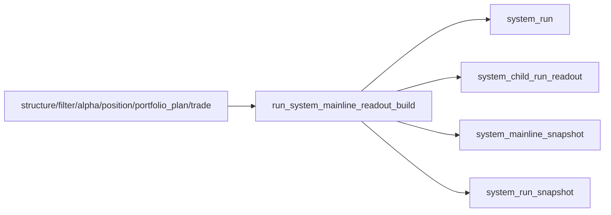

# system 主链 bounded acceptance readout 与 audit bootstrap 结论
结论编号：`27`
日期：`2026-04-11`
状态：`生效中`

## 裁决

- 接受：`system` 最小官方 readout / audit bootstrap 已成立，`system_run / system_child_run_readout / system_mainline_snapshot / system_run_snapshot` 四表与 bounded runner 已正式落地。
- 接受：`scripts/system/run_system_mainline_readout_build.py` 现在是 `system` 主链 bounded acceptance readout 的正式入口；它只消费官方 `structure / filter / alpha / position / portfolio_plan / trade` 账本与 `trade_*` 正式落表事实，不回读私有中间过程。
- 接受：`system_mainline_snapshot` 已能按 `portfolio_id + snapshot_date + system_scene + system_contract_version` 冻结系统级主链读数，并记录 `planned_entry / blocked_upstream / planned_carry / open_leg / current carry` 与引用的官方 `portfolio_plan_run / trade_run`。
- 接受：`system` 当前已经具备真实的 `inserted / reused / rematerialized` 审计语义；child-run readout 与 mainline snapshot 的物化动作不再停留在聊天口头说明。
- 裁决：下一张若继续推进 `system`，应开 `runtime / orchestration` 新卡，而不是修复卡或重新实现上游业务事实的替代卡。

## 原因

- `26` 已裁决主链 `data -> malf -> structure -> filter -> alpha -> position -> portfolio_plan -> trade` 在当前口径下真实成立；`27` 的真实缺口不再是上游 truthfulness，而是系统层缺少官方 readout / audit / freeze 落点。
- 如果没有 `system` 最小正式账本，仓库仍然无法以官方方式回答：
  - 这次 bounded mainline 引用了哪些 child run
  - 当前系统级 snapshot 是什么
  - 这次结果是首次插入、复用还是重物化
- 新增 unit test 已证明：
  - 首次 `system` 物化会正式插入 child-run readout 与 mainline snapshot
  - 同窗口复跑会得到真实 `reused`
  - 当上游 `trade_run` 更新后，同一系统自然键下的 snapshot 会被真实标记为 `rematerialized`
- 原有 `tests/unit/system/test_mainline_truthfulness_revalidation.py` 继续通过，说明本轮 `system` bootstrap 没有反向破坏 `26` 已确认的主链边界。

## 影响

- 当前最新生效结论锚点切换为 `27-system-mainline-bounded-acceptance-readout-and-audit-bootstrap-conclusion-20260411.md`。
- `system` 模块不再处于“未开工”状态；仓库现在首次拥有官方 `system` 层最小历史账本，而不再只有模块级账本。
- 后续对“当前主链是否成立、引用了哪些 child run、这次是 reuse 还是 rematerialize”的系统级回答，必须以 `system` 正式账本为准，不再以聊天口头裁决为准。
- 后续若继续扩 `system`，边界必须建立在本轮形成的正式账本之上；不能绕开 `27` 直接把下一张写成 live broker/account lifecycle 或 filled/pnl/reconciliation 全量 runtime 卡。

## 验证

- `python -m pytest -p no:cacheprovider --basetemp H:\Lifespan-temp\pytest\system_27 tests/unit/system/test_system_runner.py -q`
- `python -m pytest -p no:cacheprovider --basetemp H:\Lifespan-temp\pytest\system_truth tests/unit/system/test_mainline_truthfulness_revalidation.py -q`
- `python scripts/system/check_doc_first_gating_governance.py`
- `python scripts/system/check_development_governance.py src/mlq/system scripts/system tests/unit/system docs/03-execution`
- `python .codex/skills/lifespan-execution-discipline/scripts/check_execution_indexes.py --include-untracked`

## system 账本层图

