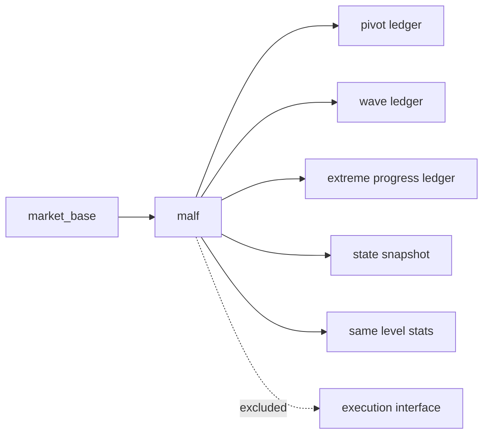

# malf semantic canonical contract freeze

卡片编号：`29`
日期：`2026-04-11`
状态：`待施工`

## 目标

把 `malf` 从 `bridge-v1` 的近似标签层，正式收缩为纯结构语义账本：

- 输入只有本级别 `price bar`
- 核心只有 `HH / HL / LL / LH / break / count`
- 正式账本只有 `pivot / wave / extreme / state / same_level_stats`

## 依赖

- [06-malf-semantic-canonical-contract-freeze-charter-20260411.md](</h:/lifespan-0.01/docs/01-design/modules/malf/06-malf-semantic-canonical-contract-freeze-charter-20260411.md>)
- [06-malf-semantic-canonical-contract-freeze-spec-20260411.md](</h:/lifespan-0.01/docs/02-spec/modules/malf/06-malf-semantic-canonical-contract-freeze-spec-20260411.md>)
- [23-malf-pure-semantic-ledger-boundary-freeze-conclusion-20260411.md](</h:/lifespan-0.01/docs/03-execution/23-malf-pure-semantic-ledger-boundary-freeze-conclusion-20260411.md>)
- [24-malf-mechanism-layer-break-confirmation-and-stats-sidecar-conclusion-20260411.md](</h:/lifespan-0.01/docs/03-execution/24-malf-mechanism-layer-break-confirmation-and-stats-sidecar-conclusion-20260411.md>)
- [25-malf-mechanism-ledger-bootstrap-and-downstream-sidecar-integration-conclusion-20260411.md](</h:/lifespan-0.01/docs/03-execution/25-malf-mechanism-ledger-bootstrap-and-downstream-sidecar-integration-conclusion-20260411.md>)

## 任务

1. 裁决 canonical `malf` 的正式边界，不再让 `MA/ret20/new_high_count` 继续冒充正式真值。
2. 冻结正式核心账本：
   - `pivot_ledger`
   - `wave_ledger`
   - `extreme_progress_ledger`
   - `state_snapshot`
   - `same_level_stats`
3. 写死 pivot 的 `confirmed_at` 语义，禁止未来函数。
4. 写死时间级别独立原则：月 / 周 / 日各自算结构，不跨级别共享状态和计数。
5. 把 `execution_interface / allowed_actions / confidence / context feedback` 从 `malf core` 排除。
6. 回填 `29` 的 evidence / record / conclusion。

## Canonical 语义边界图

## 范围

### 包含

- `docs/01-design/modules/malf/06-*`
- `docs/02-spec/modules/malf/06-*`
- `docs/03-execution/29-*`
- `docs/03-execution/evidence/29-*`
- `docs/03-execution/records/29-*`

### 不包含

- `30` 的正式代码实现
- `31` 的 downstream rebind
- `32` 的 truthfulness revalidation

## 历史账本约束

- 实体锚点：`asset_type + code + timeframe`
- 业务自然键：
  - pivot：`asset_type + code + timeframe + pivot_bar_dt + pivot_type`
  - wave：`asset_type + code + timeframe + wave_id`
  - extreme：`asset_type + code + timeframe + wave_id + extreme_seq`
  - snapshot：`asset_type + code + timeframe + asof_bar_dt`
- 批量建仓：`30` 中按 `code + timeframe` 全历史回放
- 增量更新：`30` 中按 dirty scope 增量回放
- 断点续跑：`30` 中以 queue/checkpoint/replay 实现
- 审计账本：`29` execution 文档与 `30` run 表

## 完成标准

1. canonical `malf` 正式口径冻结为纯结构语义。
2. `bridge-v1` 被明确定义为兼容产物，而不是正式真值。
3. `30-32` 的后续实现边界不再含糊。
