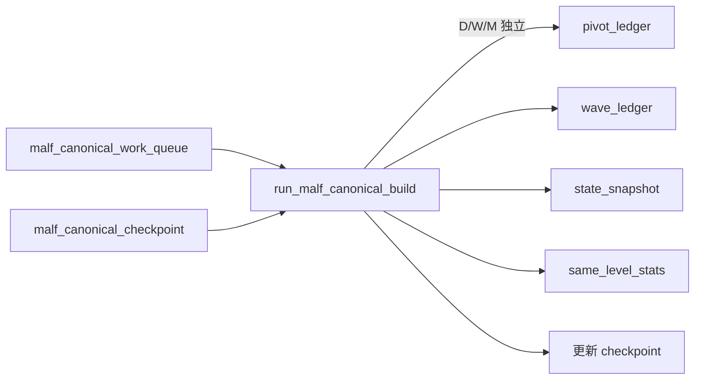

# malf canonical ledger and data-grade runner bootstrap 结论

日期：`2026-04-11`
状态：`已裁决`

`30` 已正式通过。canonical `malf v2` 现在已经具备最小可运行实现，并与 bridge v1 并存。

本次正式落地内容：

- 新增 canonical `malf` 表族：
  - `malf_canonical_run`
  - `malf_canonical_work_queue`
  - `malf_canonical_checkpoint`
  - `malf_pivot_ledger`
  - `malf_wave_ledger`
  - `malf_extreme_progress_ledger`
  - `malf_state_snapshot`
  - `malf_same_level_stats`
- 新增 `src/mlq/malf/canonical_runner.py`
- 新增 `scripts/malf/run_malf_canonical_build.py`
- `src/mlq/malf/__init__.py` 已导出 canonical runner 与正式表名常量
- `AGENTS.md`、`README.md`、`pyproject.toml` 已同步入口，明确 canonical runner 为正式 v2 入口，bridge v1 只保留过渡职责

本次 runner 已成立的能力：

- 从官方 `market_base.stock_daily_adjusted(adjust_method='backward')` 读取 bars
- 支持 `D / W / M` 三个级别各自独立计算
- 具备 `work_queue + checkpoint + run` 的最小 data-grade 续跑语义
- 物化 pivot 的 `confirmed_at`
- 物化 wave / extreme / state / same_level_stats

## 影响

- `malf` 现在拥有两套并行 runner：bridge v1（`run_malf_snapshot_build.py`）负责兼容输出，canonical v2（`run_malf_canonical_build.py`）负责正式纯语义账本。
- `structure / filter / alpha` 当前仍消费 bridge v1 出口；切换到 canonical v2 上游属于 `31` 的任务边界。
- 当前正式主链 `data -> ... -> system` 的 truthfulness revalidation 属于 `32` 的任务边界，不在本轮内承诺。

## canonical runner 续跑图

当前保留边界：

- canonical runner 不回写 bridge v1 表
- `31` 之前下游 `structure / filter / alpha` 仍未改绑 canonical v2
- `32` 之前整条主链尚未完成 canonical `malf` truthfulness revalidation

验证已通过：

- `pytest tests/unit/malf/test_canonical_runner.py -q`
- `pytest tests/unit/malf/test_malf_runner.py tests/unit/malf/test_mechanism_runner.py tests/unit/malf/test_canonical_runner.py -q`

从这一结论开始，`malf` 已不再只有“近似体规划”，而是已经拥有正式 canonical v2 runner 与正式账本外壳；后续施工重点转入 `31` 的 downstream rebind 与 `32` 的主链复核。
