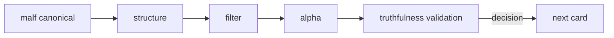

# downstream truthfulness revalidation after malf canonicalization

卡片编号：`32`
日期：`2026-04-11`
状态：`已完成`

## 需求
- 问题：canonical malf 与下游 rebind 完成后，必须重新确认 `structure -> filter -> alpha` 的主线 truthfulness，并用真实数据做最小复核。
- 目标结果：裁决 canonical malf 是否已经成为正式可信上游，并决定 `100-105` 是否可以恢复推进。
- 为什么现在做：这是 malf 卡组的收口卡，也是恢复 trade/system 施工资格的门槛。

## 设计输入

- 设计文档：
  - `docs/01-design/modules/malf/09-downstream-truthfulness-revalidation-after-malf-canonicalization-charter-20260411.md`
- 规格文档：
  - `docs/02-spec/modules/malf/09-downstream-truthfulness-revalidation-after-malf-canonicalization-spec-20260411.md`
- 当前锚点结论：
  - `docs/03-execution/31-structure-filter-alpha-rebind-to-canonical-malf-conclusion-20260411.md`

## 任务分解

1. 用 bounded revalidation 重验 canonical malf 之后的主线 truthfulness。
2. 用真实数据样本做最小 smoke。
3. 裁决后续 `100-105` 是否恢复正式施工。

## 复核路径图

## 实现边界

- 范围内：
  - `docs/01-design/modules/malf/09-*`
  - `docs/02-spec/modules/malf/09-*`
  - `docs/03-execution/32-*`
  - `docs/03-execution/evidence/32-*`
  - `docs/03-execution/records/32-*`
  - 相关测试与验证命令
- 范围外：
  - trade exit/pnl
  - system orchestration

## 历史账本约束

- 实体锚点：以 bounded window + sample instrument 集合作为 revalidation/smoke 锚点。
- 业务自然键：以 `sample_scope + runner_name + validation_scene` 作为验证结果自然键；`run_id` 只做审计。
- 批量建仓：首次对固定 bounded 样本跑全链 revalidation。
- 增量更新：后续只补跑新增窗口或新增样本。
- 断点续跑：验证中断后允许按 runner 级 checkpoint 恢复。
- 审计账本：审计落在相关模块正式 run 表与 `32` 的 evidence / record / conclusion。

## 收口标准

1. canonical malf 之后的主线 truthfulness 被正式裁决。
2. 有最小真实数据 smoke 证据。
3. 明确 `100-105` 是否恢复施工。
