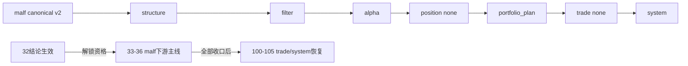

# downstream truthfulness revalidation after malf canonicalization 结论

日期：`2026-04-11`
状态：`已裁决`

## 裁决

- 接受

## 原因

- `python scripts/system/check_doc_first_gating_governance.py` 通过，当前待施工卡 `32` 已经补齐需求、设计、规格、任务分解和历史账本约束。
- `pytest -p no:cacheprovider tests/unit/system/test_canonical_malf_rebind.py tests/unit/system/test_mainline_truthfulness_revalidation.py tests/unit/system/test_doc_first_gating_governance.py tests/unit/system/test_system_runner.py -q` 通过，结果为 `6 passed`，没有失败。
- 关键回归确认默认 `structure -> filter -> alpha` 已改绑到 canonical `malf_state_snapshot(timeframe='D')`，`alpha formal signal` fallback 仍然关闭，后续主链没有回退迹象。

## 影响

- `100-105` 获得恢复推进资格，但**必须在 `33-36` 全部收口后才能实际启动**。
  - `33-malf-downstream-canonical-contract-purge`：下游合同清除旧字段壳
  - `34-malf-multi-timeframe-downstream-consumption`：W/M 多级别消费冻结
  - `35-downstream-data-grade-checkpoint-alignment-after-malf`：下游 queue/checkpoint 对齐
  - `36-malf-wave-life-probability-sidecar-bootstrap`：波段寿命概率 sidecar
- `trade / system` 继续按各自正式卡推进，不在 `32` 里越界展开。

## canonical 主链真值收口图

