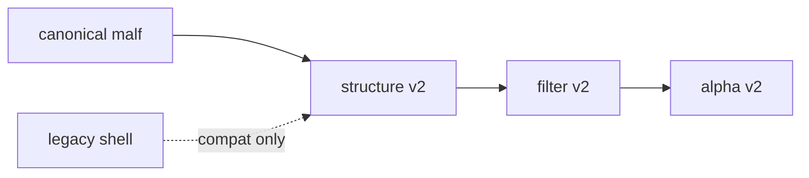

# malf downstream canonical contract purge

卡片编号：`33`
日期：`2026-04-11`
状态：`待执行`

## 需求

- 问题：
  当前 `structure / filter / alpha` 虽已默认接入 canonical `malf`，但正式合同仍大量沿用 bridge-era 字段壳，导致 `malf` 只成为真值上游，没有成为下游正式语义中心。
- 目标结果：
  把下游正式合同切换到 canonical `malf` 字段族，降级旧字段壳为兼容桥或派生字段。
- 为什么现在做：
  若不先清掉旧字段壳，后续多级别消费、寿命 sidecar 与下游 data-grade 续跑都会建立在混杂语义上。

## 设计输入

- 设计文档：
  - `docs/01-design/modules/malf/10-malf-downstream-canonical-contract-purge-charter-20260411.md`
- 规格文档：
  - `docs/02-spec/modules/malf/10-malf-downstream-canonical-contract-purge-spec-20260411.md`
- 当前锚点结论：
  - `docs/03-execution/32-downstream-truthfulness-revalidation-after-malf-canonicalization-conclusion-20260411.md`

## 合同图

## 任务分解

1. 盘点 `structure / filter / alpha` 中仍属旧语义壳的正式字段。
2. 冻结 canonical `malf` 字段在 `structure / filter / alpha` 的正式输入合同。
3. 把旧字段壳降级为兼容桥、派生字段或审计字段。
4. 补齐覆盖 canonical 语义贯穿的单元测试。
5. 回填 `33` 的 evidence / record / conclusion 与索引账本。

## 实现边界

- 范围内：
  - `docs/01-design/modules/malf/10-*`
  - `docs/02-spec/modules/malf/10-*`
  - `docs/03-execution/33-*`
  - `src/mlq/structure/`
  - `src/mlq/filter/`
  - `src/mlq/alpha/`
- 范围外：
  - `W/M` 多级别消费
  - 下游 queue/checkpoint 体系
  - 波段寿命概率 sidecar

## 历史账本约束

- 实体锚点：`structure / filter / alpha` 仍以 `asset_type + code` 为标的锚点，并以 canonical `malf` 的时间级别读数作为正式上游事实。
- 业务自然键：继续使用各模块正式 `snapshot_nk / signal_nk` 作为业务自然键；`run_id` 只做审计。
- 批量建仓：对历史 bounded 窗口补齐 canonical 字段并完成旧合同迁移回填。
- 增量更新：新窗口默认只产出 canonical 正式字段，旧字段壳不再新增主判断职责。
- 断点续跑：本卡阶段先保持稳定自然键幂等回填，`work_queue / checkpoint` 对齐在 `35` 处理。
- 审计账本：审计落在现有 `structure / filter / alpha` run 表及 `33` 的 execution 闭环文档。

## 收口标准

1. `structure / filter / alpha` 的正式主输入合同切到 canonical `malf` 字段。
2. 旧字段壳已降级，不再主导正式判断。
3. 有测试证明 canonical 语义贯穿下游。
