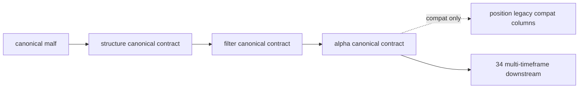

# malf downstream canonical contract purge 结论

日期：`2026-04-12`
状态：`已裁决`

## 裁决

- 接受

## 原因

- `structure_snapshot / filter_snapshot` 的正式主输出已切到 canonical `major_state / trend_direction / reversal_stage / wave_id / current_hh_count / current_ll_count`，旧字段壳不再主导正式判断。
- `alpha_trigger_event / alpha_formal_signal_event` 已改用 canonical 上游上下文进行指纹与物化，默认 `pas_context_snapshot` fallback 已移除。
- `alpha_formal_signal_event` 中残留的 `malf_context_4 / lifecycle_rank_*` 已降级为派生兼容字段，只为当前 `position` 过渡消费服务，不再代表正式真值。
- `alpha_family_event.payload_json` 已将上游指纹结构化落表，可以直接读到 `structure_progress_state` 等 canonical rematerialized 证据。
- `doc-first gating` 与 `16` 个针对性回归用例均通过，说明 `33` 的 purge 没有打断 canonical downstream 主链。

## 影响

- 当前最新生效结论锚点推进到 `33-malf-downstream-canonical-contract-purge-conclusion-20260412.md`。
- 当前待施工卡推进到 `34-malf-multi-timeframe-downstream-consumption-card-20260411.md`，后续多级别消费可以直接建立在 canonical downstream 契约上。
- `35` 可以在不再回头清理 bridge-era 正式字段壳的前提下，专注做 downstream data-grade checkpoint / dirty queue 对齐。
- `position` 及其后的恢复卡必须在后续阶段完成对 canonical `alpha` 上下文的正式消费，届时才能物理移除 `alpha` 账本中的兼容派生列。

## 结论结构图

