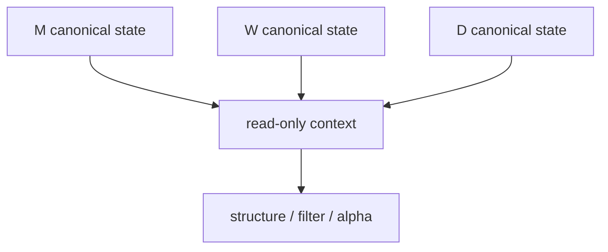

# malf multi-timeframe downstream consumption

卡片编号：`34`  
日期：`2026-04-11`  
状态：`已收口`

## 需求

问题：canonical `malf` 已独立沉淀 `D / W / M`，但当前下游正式主链仍主要消费 `D`，高周期真值还没有成为正式下游可读契约。  
目标结果：冻结 `W/M` 作为 `structure / filter / alpha` 的只读 canonical context，并显式落表 `daily/weekly/monthly` 多周期字段族。  
为什么现在做：`33` 已完成 canonical purge；如果不把 `W/M` 正式接入下游，`malf` 仍不是下游多级别运转中心。

## 设计输入

- 设计文档：
  - `docs/01-design/modules/malf/11-malf-multi-timeframe-downstream-consumption-charter-20260411.md`
- 规格文档：
  - `docs/02-spec/modules/malf/11-malf-multi-timeframe-downstream-consumption-spec-20260411.md`
- 上一锚点结论：
  - `docs/03-execution/33-malf-downstream-canonical-contract-purge-conclusion-20260412.md`

## 消费图

## 任务分解

1. 冻结 `structure / filter / alpha` 的 `daily/weekly/monthly` 多周期正式字段族。
2. 明确 `W/M` 只读上下文边界，以及 `source_context_nk` 的挂接与续算规则。
3. 补齐 `structure / filter / alpha` 多级别消费与 rematerialize 测试。
4. 回填 `34` 的 `evidence / record / conclusion` 与执行索引。

## 实现边界

- 范围内：
  - `docs/01-design/modules/malf/11-*`
  - `docs/02-spec/modules/malf/11-*`
  - `docs/03-execution/34-*`
  - `src/mlq/structure/`
  - `src/mlq/filter/`
  - `src/mlq/alpha/`
- 范围外：
  - 高周期只读背景反写 `malf core`
  - 下游 queue/checkpoint 对齐
  - trade / system 恢复链路

## 历史账本约束

实体锚点：`asset_type + code + base_timeframe`，并通过 `daily/weekly/monthly source_context_nk` 挂接高周期只读上下文。  
业务自然键：继续使用各层正式 `snapshot_nk / signal_nk / trigger_event_nk`，多周期上下文字段只参与指纹与审计，不替代主键。  
批量建仓：对历史 bounded 窗口回填 `daily/weekly/monthly` 显式字段，不改写既有 `D` 主语义。  
增量更新：按 `D` 主窗口消费最新 `W/M asof_date <= D asof_date` 的 canonical 上下文。  
断点续跑：本卡保持 bounded 幂等物化；queue/checkpoint 对齐留给 `35`。  
审计账本：审计继续落在各模块 run 表、run bridge，以及 `34` execution 文档闭环。

## 收口标准

1. `structure / filter / alpha` 已正式落表 `daily/weekly/monthly` 多周期字段族。
2. 测试证明 `W/M` 变动会触发下游 rematerialize，但不会反写 `D` 级别 `malf core` 真值。
3. `conclusion` 明确 `W/M` 仅为只读背景，不是 `malf` 状态机输入。
4. 当前执行索引已推进到 `35-downstream-data-grade-checkpoint-alignment-after-malf-card-20260411.md`。
