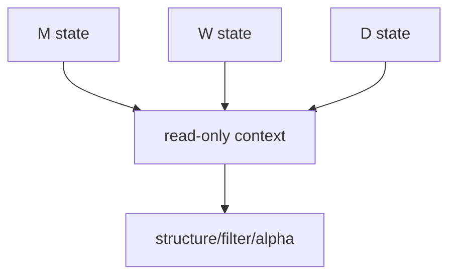

# malf multi-timeframe downstream consumption

卡片编号：`34`
日期：`2026-04-11`
状态：`待执行`

## 需求

- 问题：
  canonical `malf` 已独立沉淀 `D / W / M`，但当前下游正式主链仍只默认消费 `D`，导致高周期真值停留在账本层。
- 目标结果：
  冻结 `W/M` 作为下游只读 canonical context 的正式消费合同。
- 为什么现在做：
  如果 `malf` 要成为下游运转中心，多级别真值必须正式进入下游，而不是只停留在 `malf` 内部。

## 设计输入

- 设计文档：
  - `docs/01-design/modules/malf/11-malf-multi-timeframe-downstream-consumption-charter-20260411.md`
- 规格文档：
  - `docs/02-spec/modules/malf/11-malf-multi-timeframe-downstream-consumption-spec-20260411.md`
- 当前锚点结论：
  - `docs/03-execution/33-malf-downstream-canonical-contract-purge-conclusion-20260412.md`

## 消费图

## 任务分解

1. 冻结 `D/W/M` 多级别消费的正式字段集。
2. 明确 `W/M` 只读上下文边界与 `source_context_nk` 记录规则。
3. 补齐 `structure / filter / alpha` 的多级别消费测试。
4. 回填 `34` 的 evidence / record / conclusion 与索引账本。

## 实现边界

- 范围内：
  - `docs/01-design/modules/malf/11-*`
  - `docs/02-spec/modules/malf/11-*`
  - `docs/03-execution/34-*`
  - `src/mlq/structure/`
  - `src/mlq/filter/`
  - `src/mlq/alpha/`
- 范围外：
  - 高周期读数回写 `malf core`
  - 交易动作建议
  - 下游 queue/checkpoint 对齐

## 历史账本约束

- 实体锚点：
  `asset_type + code + base_timeframe`，并通过 `source_context_nk` 关联 `W/M` 只读上下文。
- 业务自然键：
  继续使用下游正式 `snapshot_nk / signal_nk` 作为自然键，并附带 `weekly/monthly source_context_nk`。
- 批量建仓：
  对历史 bounded 窗口回填 `W/M` 只读上下文字段，不改写既有 `D` 级别正式真值。
- 增量更新：
  新窗口按 `D` 主窗口同步挂接最近可用 `W/M` canonical 快照。
- 断点续跑：
  本卡先保持 bounded 幂等补写；queue/checkpoint 对齐在 `35` 处理。
- 审计账本：
  审计落在各模块 run 表与 `34` execution 闭环文档。

## 收口标准

1. `W/M` 已正式进入下游只读消费合同。
2. 测试证明高周期 context 不反向改写 `D` 级别 `malf core` 真值。
3. `conclusion` 明确 `W/M` 是只读背景，不是状态机输入。
